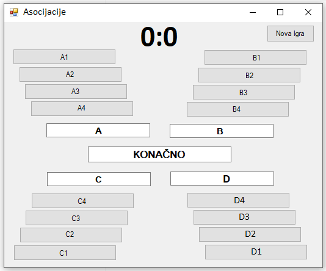

Појединачне класе - решен пример
================================

Овде ћемо на једном примеру да илуструјемо анализу проблема који није детаљно спецификован, 
односно доношење могућих одлука о интерфејсу на основу описа проблема и евентуалног искуства.

Приликом смишљања решења, применићемо различите концепте ООП, о којима је било речи. 
У класи која представља игру користиће се приватни чланови и јавна својства (енкапсулација 
и апстракција), истоимени методи (статички полиморфизам), као и две врсте индексера, са 
једним и два индекса (поново апстракција). У класи ``Program`` користиће се статички методи, 
јер се ова класа не инстанцира. 

Задатак - игра асоцијације
--------------------------

.. questionnote::

    Написати класу ``Asocijacije``, која представља основу за познату игру асоцијације.
    
    Након писања класе, написати и **конзолну** апликацију, која употребом класе омогућава 
    играње игре за једног играча.

У игри постоји табела са одређеним бројем колона (најчешће 4), а у свакој колони 
дат је одређени број појмова, исти за сваку колону. Појмови на почетку нису видљиви.
Појмови из сваке колоне асоцирају на појам који је решење те колоне, а решења колона 
асоцирају на коначно решење.

Игру може да игра један или више играча. Ако има два играча, они играју наизменично.
У случају да игра више играча, они играју редом у круг.

Потез једног играча састоји се у следећем:

- ако има још појмова који нису видљиви, играч бира једно неотворено поље из табеле и 
  отвара га, чиме појам са тог поља постаје видљив. 
- играч покушава да погоди решење неке од колона или коначно решење. Ако у томе успе, 
  добија одређени број поена и има право да покуша да погоди решење још неке колоне 
  или коначно решење.

За успешно решавање колоне играч добија 3 поена, плус за свако неотворено поље те 
колоне по један додатни поен. Када се реши једна колона, отварају се сва њена поља.

За успешно налажење коначног решења играч добија 8 поена, плус за сваку нерешену колону
додатни број поена, који би добио решавањем те колоне. 

Игра се завршава када се нађе коначно решење (или када истекне време за погађање).

    Игра асоцијације, имплементирана у апликацији са графичким интерфејсом.

Решење
------

Овде дајемо једно могуће решење за класу ``Asocijacije``. 

Као прво, корисник треба да зна како да прикаже поља са појмовима, односно поља за решења 
колона и коначно решење. Прецизније, корисник класе треба да зна да ли треба да испише назив 
поља (нпр. **"C2"**, **"Kolona C"**, **"Konacno"**), или сам појам, односно решење. Један 
начин да кориснику обезбедимо потребне информације су јавни методи помоћу којих он може да 
пита да ли је одређено поље отворено, да ли је колона решена, односно да ли је решена цела 
игра. У том случају, корисник би приликом приказивања табеле морао да проверава стање сваког 
поља. Удобније решење за корисника би било да обезбедимо методе које враћају одговарајући 
стринг са именом поља или појмом, односно решењем, у зависности од стања поља. Још удобије 
је да за поља са појмовима користимо индексер са два индекса, за решења колона инексер са 
једним индексом, а за коначно решење својство. Ови индексери и својство би израчунавали свој 
одговор, уместо да то препуштамо кориснику.

Даље, да би корисник класе ``Asocijacije`` (главни програм, тј. метод ``Main``) могао да 
имплементира игру, потребно је да класа може да му одговори на следећа питања.

- Да ли су сва поља са појмовима отворена? Ово је потребно да би корисник класе знао 
  да ли да понуди играча да отвори поље.
- Да ли је отварање датог поља успело (или: да ли је дато поље већ отворено)? Ово је потребно 
  да играч не би могао да (случајно или намерно) отвори већ отворено поље и тиме пропусти (или 
  избегне) отварање новог поља.
- Да ли је покушај решавања колоне успео? Ово је потребно да би се знало да ли играч има право 
  да настави да решава, или следи отварање новог поља. Ова информација може да се врати у облику 
  броја добијених поена за покушај (за неуспешан покушај добија се 0 поена, а за успешан неки 
  позитиван број). Тиме омогућавамо кориснику класе да уједно и прикаже број освојених поена за 
  последњи покушај решавања, а такође и да успут рачуна укупан број поена.
- Да ли је покушај налажења коначног решења успео? Очигледно, ово је потребно да би корисник 
  класе знао да ли је игра завршена. Ова информација такође може да се врати као број освојених 
  поена за покушај налажења коначног решења.

Да бисмо омогућили одговоре на набројана питања, размотримо које све информације класа 
``Asocijacije`` треба да памти. Очигледно потребне информације су димензије табеле појмова (то 
ће бити целобројна поља ``brKolona``, ``brPojmova``), сама табела (поље ``pojam``, које је матрица 
стрингова), решења колона (поље ``resenjeKolone``, које је низ стрингова) и коначно решење (поље 
``konacnoResenje`` типа стринг). Поред ових поља, можемо да се определимо да додатно памтимо и 
одржавамо следеће податке:

- поље ``bool[,] otvoreno``, које говори да ли је одређено поље табеле отворено, 
- поље ``int[] brNeotvorenih``, које садржи број неотворених поља по колонама (згодно због 
  лакшег одређивања броја поена за покушај решавања), 
- поље ``bool[] resenaKolona``, које говори да ли је одређена колона решена, 
- поље ``bool reseno``, које говори да ли је нађено коначно решење.

За одговор на питање да ли су сва поља са појмовима отворена направићемо метод ``bool 
SveOtvoreno()``. За одговор на питање да ли је отварање датог поља успело, метод ``bool 
Otvori(int iKolona, int iPojam)`` који отвара поље уједно ће да врати ову информацију. 
Методи који обрађују покушај решавања колоне, односно налажења коначног решења, уједно ће 
да врате и број освојених поена. Ова два метода могу да носе исто име ``Pokusaj``, пошто се 
разликују по листи параметара. 

- Метод ``public int Pokusaj(int kol, string odgovor)`` обрађује покушај решавања колоне.
- Метод ``public int Pokusaj(string odgovor)`` обрађује покушај налажења коначног решења.

Овај интерфејс је  довољан да се игра реализује. Ипак, у нашем решењу се појављаују још 
два јавна метода и једно својство који нису неопходни у овом програму, али могу да пруже 
додатну удобност другим корисницима класе. То су:

- метод ``public bool Otvoreno(int kol, int p)``, који говори да ли је дато поље одтворено,
- метод ``public bool ResenaKol(int kol)``, који говори да ли је дата колона решена,
- својство ``public bool Reseno``, које говори да ли је решена цела игра.

Методи ``Otvoreno``, ``ResenaKol`` и својство ``Reseno`` су прилично јасни, па не збуњују и 
не оптерећују корисника класе, односно не нарушавају принцип апстракције. 

Требало би да је после ове анализе и разраде кôд довољно јасан, па га нећемо детаљно 
објашњавати. 

.. activecode:: asocijacije_klasa
    :passivecode: true
    :includesrc: src/zadaci/asocijacije/asocijacije_klasa.cs

Класу можемо да тестирамо помоћу следеђег кода.

.. activecode:: asocijacije_demo
    :passivecode: true
    :includesrc: src/zadaci/asocijacije/asocijacije_demo.cs

Извршавањем датог кода треба да се добије следећи излаз.

.. code::

                 A1          vozac             C1             D1
                 A2             B2             C2             D2
                 A3             B3             C3             D3
    ------------------------------------------------------------
           Kolona A       Kolona B       Kolona C       Kolona D
    Ukupan broj poena do sada: 0

                 A1          vozac             C1             D1
                 A2          teret             C2             D2
                 A3      prikolica             C3             D3
    ------------------------------------------------------------
           Kolona A         kamion       Kolona C       Kolona D
    Ukupan broj poena do sada: 5

             brasno          vozac         centar         kaucuk
              potok          teret     geometrija          zvaka
              kamen      prikolica           kolo       izolator
    ------------------------------------------------------------
           vodenica         kamion           krug           guma
    Konacno: tocak
    Ukupan broj poena do sada: 36

Испробавање рада класе на овакав начин је корисно, зато што омогућава удобније налажење 
и исправљање грешака. Наиме, програм за тестирање, односно демонстрацију функционалности 
класе, циљано изазива различите ситуације у којима класа треба да се нађе и током стварне 
употребе. Захваљујући томе, брже се види да ли сви методи класе раде према очекивању, 
односно лакше се дебагује ако има потребе за тиме. Током испробавања рада класе проверавамо 
и да ли нам је на располагању сва потребна функционалност класе. Према томе, ово је уједно 
прилика да се по потреби вратимо и на осмишљавање класе и њену дораду, пре него што пређемо 
на нову целину у којој се класа реално користи.

|

У другом делу задатка тражи се и да се напише програм који који користи класу ``Asocijacije`` да 
би омогућио играње игре за једног играча. За тај део задатка искористићемо већ написани метод 
``Prikazi`` а имплементација играња би могла да буде остварена овако:

.. activecode:: asocijacije_igra
    :passivecode: true
    :includesrc: src/zadaci/asocijacije/asocijacije_igra.cs

