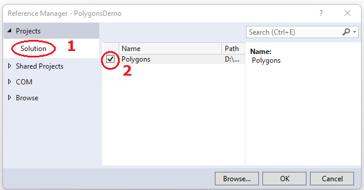
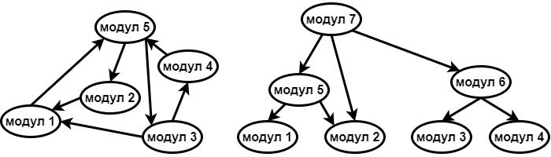

Модуларност, повезане класе
===========================

У овој лекцији:

- пример разлагања пројекта на модуле,
- шта је тесна, а шта лабава спрегнутост модула,
- које су мане тесне, односно предности лабаве спрегнутости.

У већим софтвреским пројектима посебан изазов представља организовање кôда у мање целине, 
које често неформално зовемо модулима. Препознавање и издвајање тих мањих целина између 
осталог омогућава да се оне лакше употребе и у другим пројектима.

У објектно оријентисаном програмирању, класа је природна целина која већ групише одређену 
функционалност и издваја је од осталог кода. Ипак, релативно је ретко да једна изолована 
класа сама за себе пружа довољно функционалности и не повезује се са другим класама. Обично 
је за пружање заокружене услуге потребно неколико класа које међусобно тесно сарађују.

У неким случајевима је врло једноставно да се уочи таква група класа, па се она природно 
издваја и организује у целину коју лако можемо да укључимо у разне пројекте. Међутим, некад 
је за уочавање таквих целина потребан "поглед из висине", односно сагледавање шире слике и 
размишљање на високом нивоу апстракције. Оно што уме да буде тешко при решавању конкретног, 
сложеног проблема је да умемо "да се измакнемо" и за тренутак престанемо да размишљамо само 
о том проблему. За разлагање проблема и организацију кода је веома корисно да сагледамо 
функционалности које решавају неке базичне потпроблеме и које би могле да буду корисне и у 
другом контексту.

На пример, апликација која кориснику приказује неке податке, могла би поред осталих, да 
садржи ове модуле:

- модул који дефинише класе које садрже податке од интереса,
- модул за комуникацију са сервером (успостављање конекције, прибављање података, пријављивање 
  за праћење каснијих промена у подацима, одјављивање праћења),
- модул за израчунавање података који интересују корисника (на основу прибављених података),
- модул за приказ података на разне начине (исписом у конзолни прозор, или помоћу разних 
  табела, графикона, дијаграма и сл.),
- модул за графички интерфејс према кориснику (прихватање захтева за новим подацима, за променом 
  приказа, за одјављивање праћења промена)

За сваки од ових модула би релативно једноставно могло да се организује тестирање, које не захтева 
присутност свих модула. Многи модули могу да се тестирају у изолацији, тј. без присуства иједног 
од преосталих модула. То у многоме олакшава развој, јер се неисправности (багови) или евентуалне 
регресије (назадовање у развоју, губитак функционалности услед грешке), брже и лакше откривају. 
Наведени модули могу даље да се састоје од још мањих модула, организованих на сличан начин.

Идеју о растављању на модуле ћемо детаљније да илуструјемо на следећем малом примеру, мада овај 
начин размишљања постаје утолико значајнији што је пројекат већи и сложенији.

Пример - многоуглови
--------------------

.. questionnote::

    Написати класу која представља многоугао у равни. Класа треба да омогући формирање многоугла, 
    додавање темена, уклањање последњег додатог темена, израчунавање обима и површине. 
    Поред ове финкционалности, класа треба да може да врати број темена многоугла, односно 
    координате траженог темена.

    За израчунавање обима и површине могу да се користе следеће формуле, у којима се подразумева 
    да се индекси узимају по модулу :math:`n`:
    
    .. math::

        O = \sum_{i=1}^{n} \sqrt{(x_{i}-x_{i-1})^2 + (y_i-y_{i-1})^2}.

        P = \frac{1}{2} \left |\sum_{i=1}^{n} {x_{i} \cdot (y_{i-1} - y_{i+1})} \right |

    Демонстрирати у програму употребу написане класе.

Када знамо формуле за обим и површину, не би требало да буде тешко да се напише ова класа. 
Пошто класа није прецизно спецификована, сами ћемо да одредимо њен интерејс, тј. јавна 
својства и називе и листе параметара јавних метода. Нешто ниже дато је једно од могућих 
решења.

.. activecode:: polygons_lib
    :passivecode: true
    :includesrc: src/primeri/Mnogouglovi/Polygons/Polygon.cs

Овако написан фајл може да се укључи у разне апликације, како конзолне, тако и оне са 
графичким интерфејсом. 

Изворни кôд у два фајла
'''''''''''''''''''''''

Да бисмо проверили да сви делови класе ``Polygon`` исправно раде, написаћемо конзолну 
апликацију која се састоји од два фајла са изворним кодом. У фајлу *Polygon.cs* налазиће 
се дефиниције класа ``Polygon`` и ``Point``, које смо управо видели. У фајлу *Program.cs* 
налазиће се уобичајена класа ``Program`` са методом ``Main``, која демонстрира могућности 
класе ``Polygon``.
     
.. activecode:: polygons_demo_console
    :passivecode: true
    :includesrc: src/primeri/Mnogouglovi/PolygonsDemo/Program.cs

Оваква организација се не разликује много од оне у претходним програмима. Међутим, већ тиме 
што смо класе ``Polygon`` и ``Point`` издвојили у посебан фајл и посебан именски простор, 
знатно смо олакшали употребу ових класа у различитим програмима. Да бисмо ове класе укључили 
у различите пројекте, довољно је да фајл који их садржи додамо у пројекат. То можемо да урадимо 
тако што у прозору *Solution Explorer* кликнемо десним тастером миша на пројекат и одаберемо 
опцију *Add → Existing Item...* , а затим пронађемо фајл који желимо да додамо.

Сарадња више пројеката
''''''''''''''''''''''

Уобичајен и још удобнији начин да искористимо групу класа у различитим појектима је да 
од те групе класа направимо библиотеку у облику одвојеног пројекта. Када покренемо 
окружење *Visual Studio* и изаберемо опцију *Create a new project*, треба да одаберемо 
*C# Class library* као тип пројекта. Пројекат можемо да назовемо *Polygons* и да у њега 
додамо фајл *Polygon.cs*.

Након тога, у оквиру истог решења (*solution*) креирамо нови пројекат, нпр. конзолну 
апликацију коју можемо да назовемо *PolygonsDemo*. У прозору *Solution Explorer* у оквиру 
пројеката *PolygonsDemo* треба да кликнемо десним тастером миша на ставку *Dependencies*,  
а затим у контекстном менију изаберемо ставку *Add Project Reference*. Отвориће се нови 
прозор, у коме можемо да задамо од који пројеката зависи пројекат који подешавамо.

    Прозор за додавање референци, тј. пројеката од којих зависи текући пројекат

Пошто је наш пројекат -- референца део истог решења, бирамо ``Solution`` у менију са леве 
стране, а затим означимо пројекат *Polygons*. У пројекту *PolygonsDemo* налазиће се само 
фајл *Program.cs*, који смо већ видели.

На исти начин можемо да додамо и трећи пројекат у решење, а затим да подесимо и његове 
зависности од осталих пројеката. то може нпр. да буде графичка апликација која исцртава 
многоуглове задате кликовима миша. Поступак може да се настави за било који број 
пројеката и било какве зависности међу њима. 

.. learnmorenote::

    **Употреба библиотеке и без изворног кода**
    
    Смештање модула у засебну библиотеку нам омогућава да неком дамо нашу библиотеку на употребу, 
    а да му при томе не дамо изворни кôд. Уместо изворног кода, можемо да поделимо само извршиви 
    фајл који садржи машински кôд наше библиотеке. Такав фајл има екстензију *.dll*, скраћено од 
    *Dynamic link library* (библиотека која се са апликацијом повезује динамички, тј. у току 
    извршавања апликације). У овом курсу се нећемо бавити таквим начином дељења библиотеке. 

Интерне класе и њихови делови
-----------------------------

Организовање изворног кода у више пројеката нам доноси могућност да класа или њени делови буду 
**видљиви другим класама унутар једног пројекта**. (нпр. библиотеке) али **не и ван њега**. 
    
Претопоставимо, на пример, да желимо да класа ``Point`` буде доступна класи ``Polygon``, али 
да буде недоступна ван бибиотеке, јер ван библиотеке за њом нема потребе. Ради тога је довољно 
да класу декларишемо као интерну, уместо да буде јавна. Прецизније, уместо да пишемо 

.. code-block:: csharp

    public class Point
    {
        ...
    }

писаћемо 

.. code-block:: csharp

    internal class Point
    {
        ...
    }

Реч ``internal`` може да се користи и за делове (чланове) класе, као што су методи, поља, својства 
и индексери. Ниво видљивости интерних делова класе је између јавног и приватног нивоа, што је 
приказано у следећој табели.

.. csv-table:: 
    :header: **Место употребе**, ``public``, ``internal``, ``private``
    :widths: 30, 15, 15, 40
    :align: left

    **Унутар класе**,               ✅, ✅, ✅
    **Друге класе у библиотеци**,   ✅️, ✅, ❌
    **Ван библиотеке**,             ✅️, ❌, ❌

.. infonote::

    Класе и њихови делови који су декларисани као ``internal`` **нису део интерфејса модула** 
    као целине (интерфејс модула чине само његови јавни делови). Према томе, употребом речи 
    ``internal`` у декларацијама класа и њихових делова, постижемо две ствари:

    - прецизније одређујемо ко може да користи класу а ко не, 
    - олакшавамо читање модула његовим корисницима, јер њих пре свега интересује интерфејс, односно 
      јавни део модула (интерне делове могу да прескоче, или погледају са мање пажње).

.. comment

    - појам *assembly* (.dll или .exe) превести као склоп?

Спрегнутост модула
------------------

При разлагању већег пројекта на логичке целине (модуле) посебно треба водити рачуна о такозваној 
спрегнутости кода (енгл. *code coupling*). 

Како год да разложимо кôд на модуле, неки модули ће да зависе од других. У претходном примеру 
модул *PolygonsDemo* зависи од модула *Polygons*. Трећи могући модул, *PolygonsGraphics*, 
такође би зависио од модула *Polygons*. Међузависност модула може да се представи усмереним 
графом, где модули представљају чворове, а зависности гране графа. 

.. figure:: ../../_images/spregnutost_poligoni.png
    :align: center   
    
    Међузависност модула

Циљ коме се тежи је да граф међузависности буде што једноставнији. На пример, кружне зависности 
модула (циклуси у усмереном графу) су веома непожељне, јер то значи да модули који чине циклус 
морају сви да буду укључени у сваки пројекат у коме учествује макар један од њих. Ово је јасан 
сигнал да кôд није добро подељен на модуле, јер се узајамно зависни модули понашају као један 
већи, нерастављив модул. У таквом и сличним случајевима кажемо да у коду постоји тесна 
спрегнутост (*tight coupling*). Да би кôд могао да буде боље подељен на модуле, корисно је да 
су интерфејси тих модула мали. Још један непожељан случај је да неки модул зависи од великог 
броја других модула. Таква ситуација је обично сигнал да је тај модул превелики, или да је нека 
класа у њему лоше дизајнирана (има превише функционалности).

Када је пројекат добро подељен на модуле, кôд је лабаво спрегнут (*loose coupling*). У том случају 
је граф зависности модула ацикличан и обично има релативно мали број грана. У ацикличном графу 
чворови могу да се групишу у слојеве. Најнижем слоју у графу одговарају модули који не зависе од 
других модула, и они представљају неку базичну функционалност. Модули тог најнижег слоја су добри 
кандидати за креирање потпуно независних библиотека. Вишим слојевима одговарају модули који зависе 
од претходних слојева. 

Број слојева у графу зависности модула не мора да буде велики, могуће је да их буде свега два 
или три чак и у великим пројектима. Умеће организовања кода у модуле се огледа у једноставности 
добијеног графа зависности, чак и када он има много чворова.

    
    Пример лоше, тесне спрегнуторсти (лево), где сваки модул посредно или непосредно зависи од 
    сваког другог, и добре, лабаве спрегнутости (десно), где постоје слојеви.

Неке од предности лабаво спрегнутих модула у пројекту смо већ истакли - такве модуле је знатно 
лакше одвојено тестирати, а и поново искористити у другим пројектима, или другим деловима великог 
пројекта. Поменућемо још једну корист коју имамо од лабаве спрегнутости, а која није тако 
очигледна. Током развоја програма честе су мале измене, после којих желимо да испробамо како 
програм ради. При лабавој спрегнутости, мале измене у коду погађају само мали број (малих) 
модула, тако да се извршиви фајл веома брзо формира. Када у пројекту постоје веома велики, или 
тесно спрегнути модули, они често завршавају у истом извршивом фајлу (статички се линкују), па 
може да се догоди да после измене само једне линије кода линковање траје и по неколико минута.
