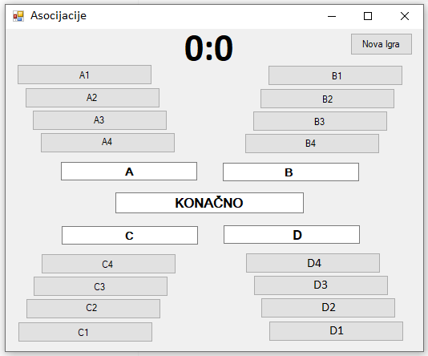

Пример дизајнирања класе
========================

У овој лекцији:

- креирање класе на основу описа проблема, 
- примена концепата ООП, 
- удобност употребе класе из различитих програма. 

|

У овој лекцији ћемо на једном примеру да илуструјемо анализу проблема који није детаљно 
спецификован, као и доношење могућих одлука о интерфејсу на основу описа проблема и 
општих препорука. 

Приликом смишљања решења, применићемо различите концепте ООП, о којима је било речи. 
У класи која представља игру користићемо приватне чланове и јавна својства (енкапсулација 
и апстракција), истоимене методе (статички полиморфизам), као и две врсте индексера, са 
једним и два индекса (и ово је један вид апстракције). 

У класи ``Program`` конзолне апликације користићемо (као и обично) само статичке методе, 
јер се ова класа не инстанцира. 

Задатак -- игра асоцијације
---------------------------

.. questionnote::

    Написати класу ``Asocijacije``, која представља основу за познату игру асоцијације.
    
    Приликом писања класе предвидети њену употребу из конзолних апликација и апликација са 
    графичким корисничким интерфејсом, које употребом те класе треба да омогуће играње игре 
    за једног или два играча. 
    
    Тестирати класу помоћу једноставне конзолне апликације, која само проверава функционалност 
    класе без могућности играња игре.

Правила игре
^^^^^^^^^^^^

У игри постоји табела са одређеним бројем колона (најчешће 4), а у свакој колони 
дат је одређени број појмова, исти за сваку колону. Појмови на почетку нису видљиви.
Појмови из сваке колоне асоцирају на појам који је решење те колоне, а решења колона 
асоцирају на коначно решење.

Игру може да игра један или више играча. Ако има два играча, они играју наизменично.
У случају да игра више играча, они играју редом у круг.

Потез једног играча састоји се у следећем:

- ако има још појмова који нису видљиви, играч бира једно неотворено поље из табеле и 
  отвара га, чиме појам са тог поља постаје видљив,
- играч покушава да погоди решење неке од колона или коначно решење. Ако у томе успе, 
  добија одређени број поена и има право да настави да погађа решење још неке колоне 
  или коначно решење, све док не погоди коначно решење, погреши или одустане од потеза.

За успешно решавање колоне играч добија 3 поена, плус за свако неотворено поље те 
колоне по један додатни поен. Када се реши једна колона, отварају се сва њена поља.

За успешно налажење коначног решења играч добија 8 поена, плус за сваку нерешену колону
додатни број поена, који би добио решавањем те колоне. 

Игра се завршава када се нађе коначно решење (или када истекне време за погађање).

    Игра асоцијације, имплементирана у апликацији са графичким интерфејсом.

.. comment

    Као што је речено на почетку, приликом осмишљавања класе 
    ``Asocijacije`` треба да се руководимо општим саветима и препорукама и применимо концепте ООП 
    о којима је било речи до сада (енкапсулација, апстракција, статички полиморфизам). Између 
    осталог, водићемо рачуна да не остављамо различитим корисницима класе већу количину истог или 
    сличног посла, који је могао да буде урађен унутар класе. 

Решење
------

У овом задатку није задат опис класе, већ нам је препуштено да је сами осмислимо на основу 
правила игре (описа проблема). Овде дајемо једно могуће решење за класу ``Asocijacije``. 

|

**Учитавање игре из фајла**

Као прво, да не бисмо сваки пут играли игру са истим појмовима, или једну од свега неколико игара 
задатих у коду, било би добро да омогућимо учитавање игре из фајла. То је посао који може да се 
уради на страни корисника, или унутар класе. Пошто замишљамо употребу ове класе из различитих 
програма, остављање учитавања игре на страни корисника би значило да сваки корисник треба да има 
наредбе за учитавање игре. 

.. suggestionnote::

    Ако различити корисници класе приликом употребе те класе треба да обаве исти или сличан посао 
    који је могао да буде урађен унутар класе, то је наговештај да дизајн класе можда може да се 
    побољша.
    
Јасно је да понављање кода није пожељно и да га треба избећи. Зато ћемо метод за учитавање игре 
из фајла да направимо унутар класе. Природно је да тај метод врати објекат класе, јер би објекат 
пре задавања појмова и решења био неупотребљив и не би имао смисла. 

Постоје два често коришћена начина да се креира објекат на основу датих података, а овде би ти 
подаци били само путања до фајла. Један начин је употреба конструктора са датим подацима као 
параметрима. 
    
.. code-block:: csharp

    // prvi nacin
    public Asocijacije(string putanja)
    {
        ...
    }
    
Други начин је статички метод (нпр. метод ``Kreiraj``) који враћа објекат. 

.. code-block:: csharp

    // drugi nacin
    public static Asocijacije Kreiraj(string putanja)
    {
        ...
    }

У случају да фајл на датој путањи не постоји, или не може да се отвори, или његов садржај није 
одговарајући, можемо да "бацимо" изузетак (било из конструктора, било из статичког метода). Статички 
метод има и другу могућност, а то је да врати ``null`` уместо објекта. На страни корисника би 
свакако требало пазити на могућност да учитавање није успело и користити или ``try-catch`` наредбу 
(у случају да класа "баца" изузетак), или проверу да ли је статички метод вратио ``null``. Овде је 
нешто боље да се определимо за статички метод који враћа ``null`` у случају неуспеха. Разлог за 
ову одлуку је то што намеравамо да класу ``Asocijacije`` издвојимо у посебну целину која се зове 
библиотека (види следећу лекцију), а не желимо да изузеци "бачени" из библиотеке буду "хватани" и 
обрађивани ван ње. 

|

**Приказивање појмова или назива поља**

Корисницима ове класе треба да омогућимо да правилно прикажу поља са појмовима, односно поља за 
решења колона и коначно решење. Прецизније, корисници класе треба да знају да ли треба да испишу 
назив поља (нпр. **"C2"**, **"Kolona C"**, **"Konacno"**), или сâм појам, односно решење. Примера 
ради, када играч реши колону или целу асоцијацију пре него што се отворе сва поља, потребно је да 
се ажурира приказ и отворе поља (прикажу појмови) свих решених колона. 

Један начин да кориснику обезбедимо потребне информације су јавни методи помоћу којих он може да 
пита да ли је одређено поље отворено, да ли је колона решена, односно да ли је решена цела 
игра. У том случају, корисник би приликом приказивања табеле морао да проверава стање сваког 
поља. То је опет посао који би морао да обави сваки корисник класе, било да је то конзолна или 
графичка апликација, а то (као што смо већ истакли) није најбоље решење.
    
Да се ове провере не би вршиле у коду сваког корисника, боље решење је да у класи обезбедимо 
методе који враћају одговарајући стринг са именом поља или појмом, односно решењем, у зависности 
од стања поља. Још мало удобније је да за поља са појмовима користимо индексер са два индекса, за 
решења колона индексер са једним индексом, а за коначно решење својство. Ови индексери и својство 
би израчунавали свој одговор, уместо да то препуштамо сваком кориснику класе, што би било понављање 
кода. 

|

**Остала потребна функционалност класе**

Да би корисник класе ``Asocijacije`` (нпр. метод ``Main`` у случају конзолне апликације) могао да 
имплементира игру, потребно је да класа може да му одговори на следећа питања. 

- Да ли су сва поља са појмовима отворена? Ово је потребно да би корисник класе знао 
  да ли да понуди играча да отвори поље, тј. да ли да му то омогући.
- Да ли је отварање датог поља успело (или: да ли је дато поље већ отворено)? Ово је потребно 
  да играч не би могао да (случајно или намерно) отвори већ отворено поље и тиме пропусти (или 
  избегне) отварање новог поља.
- Да ли је покушај решавања колоне успео? Ово је потребно да би се знало да ли играч има право 
  да настави да решава, или следи отварање новог поља (било да игру игра један или више играча). 
  Ова информација може да се врати у облику броја добијених поена за покушај (за неуспешан покушај 
  добија се 0 поена, а за успешан неки позитиван број). Тиме омогућавамо кориснику класе да уједно 
  и прикаже број освојених поена за последњи покушај решавања, а такође и да успут рачуна укупан број поена.
- Да ли је покушај налажења коначног решења успео? Очигледно, ово је потребно да би корисник 
  класе знао да ли је игра завршена. Ова информација такође може да се врати као број освојених 
  поена за покушај налажења коначног решења.

Да бисмо омогућили одговоре на набројана питања, размотримо које све информације класа 
``Asocijacije`` треба да памти. Информације које су очигледно потребне су: 

- димензије табеле појмова (то ће бити целобројна поља ``brKolona`` и ``brPojmova``), 
- сâма табела појмова (поље ``pojam``, које је матрица стрингова), 
- решења колона (поље ``resenjeKolone``, које је низ стрингова), и 
- коначно решење (поље ``konacnoResenje`` типа стринг). 

Поред ових поља, можемо да се определимо да додатно памтимо и одржавамо следеће податке:

- поље ``bool[,] otvoreno``, које говори да ли је одређено поље табеле отворено, 
- поље ``int[] brNeotvorenih``, које садржи број неотворених поља по колонама (згодно због 
  лакшег одређивања броја поена за дати покушај решавања), 
- поље ``bool[] resenaKolona``, које говори да ли је одређена колона решена, 
- поље ``bool reseno``, које говори да ли је нађено коначно решење.

За одговор на питање да ли су сва поља са појмовима отворена, направићемо метод ``bool 
SveOtvoreno()``. За одговор на питање да ли је отварање датог поља успело, метод ``bool 
Otvori(int iKolona, int iPojam)`` који отвара поље уједно ће да врати ову информацију. 
Методи који обрађују покушај решавања колоне, односно налажења коначног решења, уједно ће 
да врате и број освојених поена. Ова два метода могу да носе исто име ``Pokusaj``, пошто се 
разликују по листи параметара. 

- Метод ``public int Pokusaj(int kol, string odgovor)`` обрађује покушај решавања колоне.
- Метод ``public int Pokusaj(string odgovor)`` обрађује покушај налажења коначног решења.

Овај интерфејс је  довољан да се игра реализује. Ипак, у нашем решењу се појављују још 
два јавна метода и једно својство који нису неопходни у овом програму, али могу да пруже 
додатну удобност другим корисницима класе. То су:

- метод ``public bool Otvoreno(int kol, int p)``, који говори да ли је дато поље отворено,
- метод ``public bool ResenaKol(int kol)``, који говори да ли је дата колона решена, и
- својство ``public bool Reseno``, које говори да ли је решена цела игра.

Методи ``Otvoreno``, ``ResenaKol`` и својство ``Reseno`` су прилично јасни, па не збуњују и 
не оптерећују корисника класе, односно не нарушавају принцип апстракције. 

Требало би да је после ове анализе и разраде кôд довољно јасан, па га нећемо детаљно 
објашњавати. 

.. activecode:: asocijacije_klasa
    :passivecode: true
    :includesrc: src/primeri/asocijacije_klasa.cs

За тестирање треба да припремимо текстуални фајл са појмовима, решењима колона и коначним решењем.

.. reveal:: dugme_podaci_za_igru_asocijacije
    :showtitle: Пример фајла са подацима за игру асоцијације
    :hidetitle: Сакриј фајл са подацима за игру

    Фајл са појмовима, решењима колона и коначним решењем може да изгледа овако.
    
    .. code::

        4 4
        brasno
        potok
        kamen
        mlevenje
        vodenica
        vozac
        teret
        prikolica
        sleper
        kamion
        centar
        geometrija
        kolo
        pi
        krug
        kaucuk
        zvaka
        izolator
        rastezanje
        guma
        tocak

Класу можемо да тестирамо помоћу следећег кода.

.. activecode:: asocijacije_demo
    :passivecode: true
    :includesrc: src/primeri/asocijacije_demo.cs

Извршавањем датог кода треба да се добије следећи излаз: 

.. code::

                 A1          vozac             C1             D1
                 A2             B2             C2             D2
                 A3             B3             C3             D3
                 A4             B4             C4             D4
    ------------------------------------------------------------
           Kolona A       Kolona B       Kolona C       Kolona D
    Ukupan broj poena do sada: 0

                 A1          vozac             C1             D1
                 A2          teret             C2             D2
                 A3      prikolica             C3             D3
                 A4         sleper             C4             D4
    ------------------------------------------------------------
           Kolona A         kamion       Kolona C       Kolona D
    Ukupan broj poena do sada: 6

             brasno          vozac         centar         kaucuk
              potok          teret     geometrija          zvaka
              kamen      prikolica           kolo       izolator
           mlevenje         sleper             pi     rastezanje
    ------------------------------------------------------------
           vodenica         kamion           krug           guma
    Konacno: tocak
    Ukupan broj poena do sada: 41

.. suggestionnote::

    Испробавање рада класе на овакав начин треба радити и када се то не тражи. 

    |
    
    Овакви једноставни демо-програми су врло корисни, зато што омогућавају удобније налажење 
    и исправљање грешака. Наиме, програм за демонстрацију функционалности класе (или за детаљно 
    тестирање) циљано изазива различите ситуације у којима класа треба да се нађе и током стварне 
    употребе. Захваљујући томе, брже се види да ли сви методи класе раде према очекивању, 
    односно лакше се дебагује ако има потребе за тиме. Ово је утолико важније када је класа коју 
    тестирамо сложенија или када укључује случајност, обично тако што користи генератор случајних 
    бројева. У таквим случајевима се током стварне употребе класе (овде: играња игре) до неких 
    специфичних ситуација долази споро, или само понекад, што отежава квалитетно тестирање. 
    
    |
    
    Током испробавања рада класе проверавамо 
    и да ли нам је на располагању сва потребна функционалност класе. Према томе, ово је уједно 
    прилика да се по потреби вратимо и на осмишљавање класе и њену дораду, пре него што пређемо 
    на нову целину у којој се класа реално користи.
