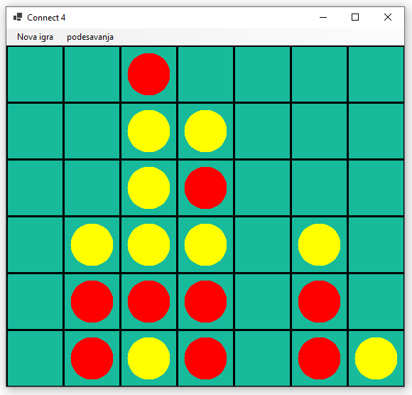

Дизајнирање класе - задаци
==========================

.. suggestionnote::

    У свим овде постављеним задацима очекује се да класа буде написана тако да може да се употреби 
    и у конзолној и у графичкој апликацији. Већ смо видели да размишљање о употреби класе из различитих 
    типова апликација, или уопште из више пројеката, може да помогне у дизајнирању те класе и доведе 
    до њеног бољег интерфејса, односно удобније и логичније употребе. 

    **Било би добро да се за бар један (а може и за сваки) од ових задатака напише и конзолна и 
    графичка апликација, тако да обе користе исту, тражену класу**. Класа за сада може и да се 
    копира у сваки од пројеката који је користи, али битно је да се не мења и не прилагођава 
    различитим пројектима. Одржавање неколико сличних верзија кода (овде: тражене класе), у којима 
    има истих и различитих делова може да постане компликовано и зато га треба избегавати.
    
    Када научимо како нека класа може са једног места да се користи у више пројеката, лако ћемо 
    преправити постојеће апликације, тако да неће бити потребе за копирањем класе и са тиме повезаног 
    ризика од уношења разлика у поједине копије класе.

.. comment

    Код сваког од задатака који следе, за израду решења типично је потребно по пар сати.

    касније:
    Задаци који следе различити су по обиму и сложености. Време за израду може да варира 
    од пар сати до пар дана, што зависи и од предзнања и увежбаности онога ко решава задатак.
    
    човече не љути се
    сијалице?
    мастерминд променљив одговор
    рандом генератор са различитим расподелама
    сервер јавних и приватних вести (методи Post, AddUser, Login, TryRead, Logout)
    симулација кретања више тела, класа систем има низ класа тело
    читач (ред по ред са више страна)
    палачинкарница (састојци, прилози)
    

Задатак 1 - игра налажења броја у сортираном низу
-------------------------------------------------

.. questionnote::

    Написати класу ``PogadjanjeBroja``, која представља основу за игру налажења броја у сортираном низу.

    Класу писати тако да може да се употреби и у конзолној и у графичкој апликацији. 

    Након писања класе, написати и конзолни или графички програм који користи ту класу 
    и омогућава играње игре за два играча.
    
Игру игра један играч. За игру, рачунар треба да припреми сортиран низ целих бројева и "замисли" 
један од тих бројева. Замишљени број је познат играчу, али елементи низа на почетку нису видљиви. 
Потез се састоји у откривању једног елемента низа, по избору играча. Циљ играча је да пронађе 
замишљени број у што мањем броју потеза.

Задатак 2 - игра меморије
-------------------------

.. questionnote::

    Написати класу ``Memorije``, која представља основу за игру *Меморије*.

    Класу писати тако да може да се употреби и у конзолној и у графичкој апликацији. 

    Након писања класе, написати и конзолни или графички програм који користи ту класу 
    и омогућава играње игре за два играча.
    
За игру је потребно неколико парова карата. Карте су измешане и поређане у низ, а на почетку игре 
су све затворене, тј. окренуте лицем на доле. Игру игра један играч, тако што у сваком потезу 
отвара две карте са стола, једну по једну. Ако две отворене карте чине пар, оне остају отворене и 
играч наставља исти потез окретањем нове две карте. Ако карте не чине пар, оне се поново затварају 
и почиње нови потез. Циљ је да се отворе све карте у што мање потеза.

Задатак 3 - игра вешала
-----------------------

.. questionnote::

    Написати класу ``Vesala``, која представља основу за игру `Вешала <https://en.wikipedia.org/wiki/Hangman_(game)>`_.

    Класу писати тако да може да се употреби и у конзолној и у графичкој апликацији. 

    Након писања класе, написати и конзолни или графички програм који користи ту класу 
    и омогућава играње игре за два играча.
    
Игру играју два играча, од којих један задаје једну или више речи (задавач), а дуги погађа 
задати текст (погађач). Погађање се састоји у тражењу да се прикажу сва појављивања једног 
слова. Уколико се то слово не појављује у тексту, погађач губи један живот. Игра се завршава 
када погађач открије сва слова од којих се састоји текст, или када изгуби све животе. Број 
живота које има погађач се договара пре почетка партије и обично је то 6.
    

Задатак 4 - игра икс -- окс
---------------------------

.. questionnote::

    Написати класу ``IksOks``, која представља основу за игру *икс -- окс*.
    Класу писати тако да може да се употреби и у конзолној и у графичкој апликацији. 
    
    Након писања класе, написати и конзолни или графички програм који користи ту класу 
    и омогућава играње игре за два играча.
    
Ову игру играју два играча на табли од 3 реда и 3 колоне, играјући наизменично. Један 
играч користи знак *X*, а други знак *O*. Табла је на почетку игре празна. Потез се 
састоји у постављању свог знака у једно поље на табли. Циљ игре је поређати 3 своја 
знака на 3 узастопна поља у праволинијскком низу, водоравно, усправно или косо.

Задатак 5 - игра потапања бродова
---------------------------------

.. questionnote::

    Написати класу ``Podmornice``, која представља основу за игру потапања бродова.
    Класу писати тако да може да се употреби и у конзолној и у графичкој апликацији. 
    
    Након писања класе, написати и конзолни или графички програм који омогућава играње игре.

Ову игру играју два играча на табли од 10 редова и 10 колона. Један играч је задавач и он 
задаје распоред бродова на табли, а други је погађач и он открива тај распоред. Сваки брод 
је представљен усправним или водоравним низом поља. Укупно треба распоредити 1 низ од 4 
поља, два низа од по 3 поља, три низа од по 2 поља и 4 појединачна квадрата. Правоугаоници 
не смеју имати заједничких тачака, чак ни темена. Погађач открива распоред бродова тако што 
поставља питања о појединим пољима, тј. "гађа их". Задавач одговара једном од речи "промашен", 
"погођен", или "побеђен" (када је последњи део последњег брода погођен). Игра траје док 
погађач не нађе тачне позиције свих бродова. 

Уобичајено је да се игра тако да оба играча истовремено буду и задавачи и погађачи. У том 
случају сваки играч на почетку игре смисли распоред који онај други играч треба да оркрије, 
а затим гађају наизменично, док један од њих не открије све бродове противника.

Конзолни програм може да се напише тако да омогућава играње игре у само једном, или у оба смера, 
тј. да распоред бродова погађа само један или оба играча. У случају да се игра двосмерно, 
програм треба да користи два објекта класе ``Podmornice``, по један за сваког играча. 

Распоред бродова може да се зада као низ од 10 стрингова дужине 10, при чему сваки стринг 
садржи само нуле и јединице. Након задавања распореда садржај конзолног прозора треба 
да се обрише, нпр. извршавањем наредбе ``Console.Clear();``. У случају двосмерног играња, 
садржај прозора се брише после сваког задавања, а затим програм наизменично нуди једног па 
другог играча да зада поље које гађа. Након задавања распореда, програм треба да приказује 
резултате гађања у облику две матрице карактера. Поља која нису гађана могу нпр. да се 
представе тачком, промашаји малим словом ``o``, а погоци великим словом ``X``.

.. infonote::

    Постоји и варијанта игре потапања бродова, у којој су могућа 4 одговора задавача: "промашен", 
    "погођен", "потопљен" и "побеђен". Одговор "погођен" се добија када у броду коме припада 
    погођено поље постоје и поља која још нису погођена, а "потопљен" када су закључно са овим, 
    погођени сви делови брода. Да би се у приказу видела разлика, бродови чији су сви делови 
    погођени могу да се означавају великим словима ``X``, а погођени делови непотопљених бродова 
    малим словима ``x``.

    Ова варијанта игре је нешто лакша за откривање распореда бродова јер је потребно мање 
    потеза, али је тежа за израчунавање одговора и текстуалне ознаке поља.
    
.. comment

    Овде
    https://sr.wikipedia.org/sr-ec/Potapanje_brodova 
    је објашњена ЛОГИЧКА игра, која за дата гађања тражи да се ЗАКЉУЧИ где су преостали бродови.

Задатак 6 - игра погађања комбинације
-------------------------------------

.. questionnote::

    Написати класу која представља основу за игру `погађања комбинације <https://sr.wikipedia.org/wiki/Генијалац_(друштвена_игра)>`_
    (игра је у разним варијантама позната под разним називима, нпр. *MasterMind*, *Бикови и краве*, *Скочко* итд.).
        
    Класу писати тако да може да се употреби и у конзолној и у графичкој апликацији. 

    Након писања класе, написати и конзолни или графички програм који омогућава играње игре.

Ову игру играју два играча, задавач и погађач. Задавач смишља комбинацију од 4 цифре, од 
којих свака има вредност од 1 до 6. Уместо 4 места и 6 могућности са свако место, могу да 
се изаберу и други параметри.

Након задавања, погађач покушава да открије задату комбинацију постављајући питања. Свако 
питање се такође састоји од 4 цифре са вредностима од 1 до 6. Задавач одговара на питање 
тако што саопшти колико цифара је погођено и на добром месту, а колико их је погођено али 
је на погрешном месту. На пример, ако је задата комбинација ``1232``, а питање ``1324``, 
одговор је ``1, 2`` (један погодак на правом месту и два поготка на погрешном месту).

Очекује се да класа буде написана тако да може да одигра улогу задавача. На пример, 
конструктор може да се напише тако да добија два параметра, број места и број могућности 
за свако место, у нашем примеру то су 4 и 6. На основу ових параметара конструктор бира 
случајну комбинацију цифара. Наравно, поред јавног конструктора, потребан је и јавни 
метод који одговара на питања погађача.

Задатак 7 - игра миноловац
--------------------------

.. questionnote::

    Написати класу која представља основу за игру `миноловац <https://sr.wikipedia.org/wiki/Minesweeper_(видео-игра)>`_
    (`Minesweeper <https://en.wikipedia.org/wiki/Minesweeper_(video_game)>`_).
        
    Класу писати тако да може да се употреби и у конзолној и у графичкој апликацији. 

    Након писања класе, написати и конзолни или графички програм који омогућава играње игре.

Ову игру игра један играч на правоугаоној табли од неколико редова и колона поља. Испд неких поља 
су скривене мине. Играч може да отвара поља, да их означава и да уклања ознаке са означених поља. 
Ако отвори поље испод кога је мина, играч је изгубио. У противном, на пољу се појављује број од 1 
до 8, који означава колико мина има око тог поља. Уколико око отвореног поља нема мина, требало би 
да се аутоматски отворе сва поља око њега (јер је то безбедно). Циљ игре је да се отворе сва она 
поља на табли, испод којих нема мина. 

Задатак 8 - игра "Састави 4"
----------------------------

.. questionnote::

    Написати класу ``Sastavi4``, која представља основу за игру *Састави 4*
    (енгл. `Connect four <https://en.wikipedia.org/wiki/Connect_Four>`_).
    
    Након писања класе, написати и конзолни или графички програм који користи ту класу 
    и омогућава играње игре за два играча.
    
Ову игру играју два играча на табли од 7 колона и 6 редова, играјући наизменично. Један играч има 
црвене, а други жуте жетоне, а табла је на почетку игре празна. Потез се састоји у постављању 
жетона своје боје на таблу. Постављени жетон пропада кроз колону до најниже слободне позиције. Циљ 
игре је поређати 4 жетона своје боје на узастопна поља у праволинијскком низу, водоравно, усправно 
или косо.

    
    Позиција у игри "Састави 4".

