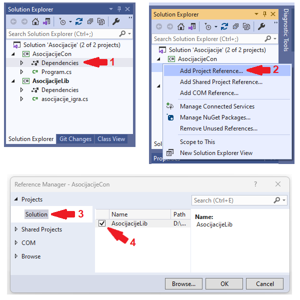

Модуларност, библиотеке
=======================

У овој лекцији:

- шта значи када кажемо да је кôд модуларан и зашто је то добро, 
- како се формира библиотека класа и како се она укључује у програм. 

|

У већим софтверским пројектима посебан изазов представља логичко организовање кода у мање целине, 
које често неформално зовемо модулима. Препознавање кандидата за те мање целине и логичко, а затим 
и техничко организовање целог програма на одговарајући начин омогућава низ предности, о којима ћемо 
нешто рећи у наставку.

Неке од предности модуларизације програма
-----------------------------------------

Лакше тестирање кода 
^^^^^^^^^^^^^^^^^^^^

Већ је било нешто речи о томе да детаљно тестирање делова програма помоћу функција намењених само 
за то има низ предности у односу на тестирање програма као целине кроз његову употребу. Овде ћемо 
навести још неке примере, који ово додатно илуструју. 

Пример -- програм за играње шаха
................................

У апликацији која се бави шахом, један модул би могао да се бави само правилима шаха, односно 
провером исправности потеза, налажењем свих исправних потеза у некој позицији, провером да ли 
је партија завршена и слично. Овај модул можемо да зовемо основни модул. Од осталих модула, 
један би могао да се бави графиком и корисничким интерфејсом, други решавањем шаховских проблема 
(налажење мата у задатом броју потеза без обзира на потезе противника, нпр. помоћу бектрека), 
трећи би могао да омогући рачунару да игра шах итд. Основни модул не зависи од других поменутих 
модула и може да се тестира као издвојена целина. Када желимо да проверимо да ли се исправно 
одиграва рокада, промоција пешака који је стигао до последњег реда, узимање у пролазу 
(`ан пасан <https://sr.wikipedia.org/sr-ec/Ан_пасан>`_), или било који други потез, згодно је да 
имамо припремљене позиције и потезе који се у њима играју, као и да се сви ти тестови извршавају 
једним захтевом. У противном бисмо морали да одиграмо по неколико припремних потеза из почетне 
позиције да бисмо дошли до позиције у којој је потез који тестирамо могућ, што није удобан начин 
тестирања. Током развоја оваквог модула тестирање треба покренути велики број пута, типично после 
исправке сваке уочене грешке, а у завршној фази после сваке измене, или бар на крају сваке сеансе 
рада на модулу. Када се узме у обзир велики број понављања тестова, постаје јасно да би тестирање 
играњем брзо постало неудобно. 

Пример -- апликација за приказ нумеричких података
..................................................

Апликација која кориснику приказује неке податке могла би, поред осталих, да садржи ове модуле:

- модул који дефинише класе које садрже податке од интереса,
- модул за комуникацију са сервером (успостављање конекције, прибављање података, пријављивање 
  за праћење каснијих промена у подацима, примање промена у подацима, одјављивање праћења),
- модул за израчунавање података који интересују корисника (на основу прибављених података),
- модул за приказ података на разне начине (исписом у конзолни прозор, или помоћу разних 
  табела, графикона, дијаграма и сл.),
- модул за графички интерфејс према кориснику (прихватање од корисника захтева за новим подацима, 
  за променом приказа, за одјављивање праћења промена)

За сваки од ових модула би релативно једноставно могло да се организује тестирање, које не захтева 
присутност свих осталих модула. Добро је да што више модула може да се тестира у изолацији, тј. без 
присуства иједног од преосталих модула, или у присуству што мањег броја других модула. Примера 
ради, није практично да тестирање модула за израчунавање, приказ или прихватање захтева корисника 
зависи од модула за комуникацију са сервером, јер сервер шаље стварне податке, а они су сваки пут 
другачији, па нисмо сигурни како треба да   изгледа резултат. Осим тога, сервер може да буде 
недоступан из разних разлога (губитак права, конекција се не успоставља, сервер није активан итд.).

Добро решење је да се модули који користе податке са сервера направе тако да податке могу да приме 
и из неког другог извора. На пример, може да се направи помоћни модул који шаље податке из унапред 
припремљеног фајла, са истог рачунара или из локалне мреже. Тај помоћни модул би слао податке на 
исти начин као и модул за рад са сервером, тако да је прелазак на један или други извор врло 
једноставан. Тиме би се умногоме олакшао развој поменутих модула који користе податке, јер на овај 
начин могу да се припреме разне специфичне секвенце података, тј. да се модули тестирају на одабраним 
подацима, уместо да тестирање зависи од тога какви ће подаци да наиђу. Овакво тестирање би омогућило 
да се неисправности (багови) или евентуалне регресије (назадовање у развоју, губитак функционалности 
услед накнадно унете грешке) брже и лакше открију. 

.. comment 

    |

    **Пример -- апликација за формирање дијаграма**

    Помоћу дијаграма се често представљају везе и односи између различитих објеката и поступака (почетак 
    процеса, крај процеса, одлука, складиштење података, обрада, база података, класа...). За приказ 
    објеката и веза се користе стандардне графичке ознаке као што су табела, стрелица, ромб, ваљак итд.
    меморијског простора итд.). Свака од ових ознака може да се нацрта помоћу такозваних графичких 
    примитива, попут правоугаоника, праве линије, круга, кружног лука и слично. Ако желимо да што већи 
    део кода може да се искористи на различитим платформама, добро је да функционалност раздвојимо у 
    следеће целине:

    - Модул који задате објекте и поступке приказује користећи стандардне графичке ознаке. Овај модул 
      зна које графичке ознаке и у ком међусобном односу треба да прикаже, али не зна како се те ознаке 
      цртају.
    - Модул који различите графичке ознаке црта помоћу примитива. Овај модул зна од којих примитива се 
      састоји која ознака, али не зна шта те ознаке представљају, нити како да нацрта примитиве.
    - Модул који реализује графичке примитиве. Овај модул зна како да нацрта линију, круг и друге 
      примитиве, али не зна шта ће од њих бити састављено. 
      
    Ако смо видели бар једно развојно окружење које подржава цртање, знамо да оно обично има функције 
    за приказ графичких примитива, па можемо да претпоставимо да и друга окружења имају такве функције. 
    то значи да би наш последњи модул имао врло једноставне функције, које само позивају по једну 
    наредбу за цртање примитива. Формирањем таквог модула постижемо да остали модули могу знатно 
    једноставније да се употребе у другим окружењима, или на другим платформама (на пример, за десктоп, 
    веб и мобилне апликације). 

Лакше разумевање затеченог кода
^^^^^^^^^^^^^^^^^^^^^^^^^^^^^^^

У првом упознавању са кодом неке апликације, за сваки њен издвојени модул довољно је да разумемо 
део намењен корисницима тог модула, односно који су јавни чланови (типично методи и својства) тог 
модула, чему они служе и како се користе. Тиме ћемо стећи увид у глобалну организацију апликације 
и начин на који њене целине сарађују. Уколико је потребно да неки модул дорадимо, можемо и тек у 
другом пролазу да га детаљније упознамо, тј. да проучимо и његову унутрашњу организацију. 

Без организације по модулима, било би много теже да одлучимо одакле да почнемо да упознајемо кôд, 
односно да стекнемо општи увид у начин на који апликација функционише.

Лакше одржавање кода
^^^^^^^^^^^^^^^^^^^^

Када кôд није организован по модулима, могуће је (бар у принципу) да измена на једном месту има 
утицаја на било који други део програма. То значи да би после сваке измене било потребно да се 
тестирају сви делови програма. Већ ово није баш практично, нарочито када је програм веома велики 
и тестирање свих делова траје дуго. Посебно је лоше ако се измене на једном месту заиста 
одражавају на разне, удаљене делове програма, јер је тада исправљање грешака веома тешко.

Насупрот овоме, када је програм организован по модулима, после измене у једном модулу довољно је 
да се тестира само тај модул. Када се потврди да је начин употребе тог модула у складу са 
очекивањем (спецификацијом), јасно је да остали модули не могу да буду погођени учињеном изменом, 
па их не треба ни поново тестирати. Осим олакшаног тестирања, још важније је лакше исправљање 
грешака, јер се функционисање веће целине лакше нехотично нарушава, него функционисање мање целине.

Лакша употреба у другим пројектима
^^^^^^^^^^^^^^^^^^^^^^^^^^^^^^^^^^

Да би неки део једног програма могао да се употреби у другом програму, потребно је да се тај део 
јасно разграничи од остатка програма и да се прецизира начин употребе тако издвојеног дела кода. 
Овако издвојене и заокружене целине су управо оно што називамо модулима. Према томе, модуларизација 
програма је основа за поновну употребу делова тог програма у другим програмима. 

Организовање кода по модулима омогућава да се један модул користи у више програма и да се тиме 
избегне копирање делова кода из једног програма у други. Ово је важно јер се копирани делови теже 
одржавају. Често се дешава да тим који ради на једном програму примети грешку и исправи је, али о 
томе не обавести тим који ради на другом програму, а који има исту грешку у коду. Зато је важно 
да се кôд организује тако да се сваки део држи само на једном месту, или да се бар зна које место 
је "главно", тј. оригинал са кога повремено може да се преузме копија коју не треба мењати.

|

У наставку ове лекције ћемо се бавити техничким детаљима издвајања модула у такву целину, која 
омогућава лаку употребу у другим програмима.

Појам, формирање и употреба библиотеке
--------------------------------------

Идеју о издвајању неког модула у целину коју лако укључујемо у разне програме илустроваћемо на 
примеру раније написане класе за играње игре *Асоцијације*. Овај пример је довољно садржајан за 
илустрацију технике, али треба имати на уму да модули често садрже више класа, а сâм концепт 
модуларности је утолико значајнији, што је цео пројекат већи и сложенији.

Библиотека класа
^^^^^^^^^^^^^^^^

Елегантан и технички добро подржан начин да један модул користимо у више програма је да од тог 
модула формирамо библиотеку. Овде под библиотеком подразумевамо тзв. библиотеку са динамичким 
повезивањем (*DLL*, скраћено од *dynamic link library*). Библиотека се након превођења смешта у 
посебан извршиви фајл, чија екстензија је ``.dll``. Подсетимо се, извршиви програм се налази у 
фајлу са екстензијом ``.exe``. Оба типа фајла садрже машинске инструкције, а разлика је у томе 
што ``.dll`` фајл није самосталан јер нема функцију ``Main`` од које би почело извршавање. 
Извршиви програм након покретања проналази фајл са библиотеком, учитава (подиже) библиотеку и 
комуницира са њом, тј. извршава методе класе из библиотеке. Зато се овај тип библиотеке и зове 
библиотека са динамичким повезивањем.

Смештање модула у библиотеку нам додатно омогућава да неком дамо нашу библиотеку на употребу, а 
да му при томе не дамо изворни кôд. Уместо изворног кода, довољно је да поделимо само извршиви 
``.dll`` фајл наше библиотеке. Исто тако, можемо да добијемо нечију библиотеку на употребу, а да 
при томе не добијемо изворни кôд библиотеке.

У овом курсу нам могућност дељења библиотеке без изворног кода није од значаја и нећемо је 
користити, али вреди знати да таква могућност постоји. 

Формирање библиотеке класа
^^^^^^^^^^^^^^^^^^^^^^^^^^

Ево како може да се формира динамичка библиотека у окружењу `Visual Studio`: 

- Након покретања  окружења `Visual Studio` треба изабрати опцију `Create a new project`. 
- За тип новог пројекта бирамо `Class Library (.NET framework)`.
- У дијалогу који се отвара, можемо као име пројекта (`Project name`) да упишемо ``AsocijacijeLib``, 
  а као име решења (`Solution name`) да упишемо Asocijacije.

Након што формирамо библиотеку, можемо фајл `Class1.cs` са изворним кодом да преименујемо нпр. у 
`asocijacije_igra.cs`. Ископирајмо раније написану класу ``Asocijacije`` у овај фајл, тако да његов 
садржај буде 

.. code-block:: csharp

    using System.IO;

    namespace AsocijacijeLib
    {
        public class Asocijacije
        {
            ...
        }
    }

Употреба библиотеке
^^^^^^^^^^^^^^^^^^^

Сада треба да креирамо пројекте који ће да користе библиотеку са класом ``Asocijacije``. То могу да 
буду друге библиотеке, конзолне апликације или графичке (`Windows Forms`) апликације. Мада сте на 
креирање новог пројекта који садржи конзолну апликацију вероватно већ увелико навикли, поновимо и 
овде кораке тог поступка: 

- Из менија изаберемо опцију `File / Add / New project` (или после десног клика на решење у прозору 
  `Solution Explorer` изаберемо опцију `Add / New project` у контекстном менију).
- За тип пројекта бирамо `Console Application`.
- У дијалогу који се отвара, можемо као име пројекта (`Project name`) да упишемо ``AsocijacijeCon``.

Након креирања конзолне апликације, потребно је да кажемо окружењу да та апликација користи библиотеку, 
односно да пројекат `AsocijacijeCon` зависи од пројекта `AsocijacijeLib`. Ево како то можемо да урадимо.

- У прозору `Solution Explorer` нађемо пројекат ``AsocijacijeCon`` и оквиру њега ставку `Dependencies`. 
  После десног клика на ту ставку (1), изаберемо `Add Project reference` из контекстног менија (2).
- У дијалогу који се отвара, на страници `Solution` (3) нађемо пројекат ``AsocijacijeLib`` укључимо га (4).

Описани поступак се види и на следећој слици.

    Поступак додавања референци, тј. пројеката од којих зависи текући пројекат

Пошто се  класа ``Asocijacije`` налази у именском простору ``AsocijacijeLib``, важно је да на почетак 
фајла ``Program.cs`` у програму додамо линију ``using AsocijacijeLib;``, да би програм могао да користи 
класу и њене методе. Конкретније, фајл ``Program.cs`` треба да буде овог облика:

.. code-block:: csharp

    using System;
    using AsocijacijeLib;

    namespace AsocijacijeCon
    {
        class Program
        {
            ...
        }
    }

    
Остаје још да напишемо кôд који помоћу дате класе нуди играча да отвара поља и погађа решења колона, 
односно коначно решење. Искористићемо раније написани метод ``Prikazi``, а имплементација самог 
играња би могла да буде остварена овако:

.. activecode:: asocijacije_igra
    :passivecode: true
    :includesrc: src/primeri/asocijacije_igra.cs
