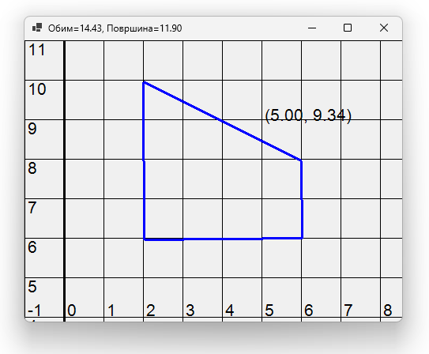
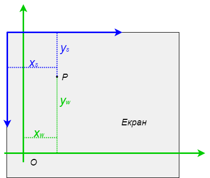
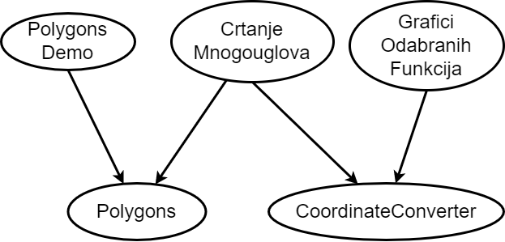

Неповезане класе
================

У овој активности:

- примери са неповезаним класама,
- више раздвојених библиотека,
- апликације које користе по једну или више датих билиотека.

До сада смо видели примере програма који користе библиотеку са једном или више класа. У примеру 
који следи, класе које користимо нису све међусобно тесно повезане. Низак ниво сарадње између 
појединих класа нам сугерише да те класе не треба да буду део једне библиотеке. Зато ћемо у овом 
примеру да распоредимо класе у **две библиотеке** и да направимо неколико апликација које користе 
једну, другу или обе библиотеке. 

Пример -- Цртање многоуглова у координатном систему
---------------------------------------------------

.. questionnote::

    Креирати графичку апликацију која приказује многоуглове у координатном систему и рачуна 
    њихове обиме и површине. Апликација треба да омогући:
    
    - Додавање темена многоугла кликом на леви тастер миша,
    - Брисање последњег додатог темена притиском на тастер `Delete`,
    - Ажурно приказивање обима и површине многоугла у насловној линији форме,
    - Приказ координата позиције на којој се налази миш,
    - Померање приказа координатног система и многоугла вучењем,
    - Увећање и умањење приказа координатног система и многоугла померањем точкића миша.

    
    Изглед апликације за цртање многоуглова

Анализа
'''''''

У овом задатку појављују се два координатна система. Један је математички координатни систем, који 
користи неку апстрактну јединичну дуж и у коме се рачунају обим и површина многоугла. Други је 
координатни систем прозора у коме цртамо, у коме се координате изражавају у пикселима. Када се у 
програму користе два координатна система, уобичајено је да се координатни систем који приказујемо 
кориснику назива **координатни систем света**, а интерни координатни систем са координатама у 
пикселима се назива **координатни систем екрана**.

    
    Координатни систем света (зелено) и координатни систем екрана (плаво)

Биће нам потребни методи за прерачунавање координата из једног у други систем и обрнуто, за 
прилагођавање формула везе када се координатни систем помери, увећа или умањи, као и за приказ 
координатног система у прозору дате величине. Сви ти методи могу да се сместе у једну класу, коју 
ћемо да назовемо ``CoordinateConverter``. 

Примера ради, један од задатака ове класе би био да одреди екранске координате :math:`(x_s, y_s)` 
неке тачке :math:`P`, ако су нам познате њене светске координате :math:`(x_w, y_w)`. Да би класа 
``CoordinateConverter`` могла да обави овај задатак, потребно је да памти екранске координате 
:math:`(x_t, y_t)` тачке :math:`O` и дужине :math:`a, b` јединичних дужи светског система у 
пикселима. На основу ових података, екранске координате било које тачке :math:`P` лако можемо 
да израчунамо по следећим формулама:

.. math::

    \begin{aligned}
    x_s &= a \cdot x_w + x_t,\\
    y_s &= -b \cdot y_w + y_t.\\
    \end{aligned}

~~~~

Још једна целина би могла да буде класа ``Polygon``, у којој би се чувала темена у координатном 
систему света и рачунали обим и површина. За израчунавање обима и површине могу да се користе 
следеће формуле, у којима се подразумева да се индекси узимају по модулу :math:`n`:

.. math::

    \begin{aligned}
    O &= \sum_{i=1}^{n} \sqrt{(x_{i}-x_{i-1})^2 + (y_i-y_{i-1})^2},\\
    P &= \frac{1}{2} \left |\sum_{i=1}^{n} {x_{i} \cdot (y_{i-1} - y_{i+1})} \right |.\\
    \end{aligned}

.. suggestionnote::

    Лако се уочава да ове две целине нису повезане. Штавише, програм може да се напише тако да класа 
    ``Polygon`` не мора да буде свесна постојања другог (екранског) координатног система, а класа 
    ``CoordinateConverter`` не мора да буде свесна постојања многоуглова. Раздвајање ових класа у 
    засебне библиотеке не отежава решавање овог задатка, а омогућава лакшу употребу направљених 
    класа у другим задацима. 

На пример, класа ``Polygon`` може да се искористи и у малој конзолној 
апликацији која само рачуна обим и површину датог многоугла, а класа ``CoordinateConverter`` може 
да се искористи у апликацији која приказује графике изабраних математичких функција. 

Ово размишљање сугерише да би добар дизајн у случају цртања многоуглова био да направимо две библиотеке, 
једну за бављење координатним системом, а другу за бављење многоуглом, а затим да напишемо и графичку 
апликацију која користи обе ове библиотеке. Касније могу да се додају и друге поменуте апликације, 
да би се потврдило да дизајн класа одговара и тим апликацијама. 

    
    Међузависност модула

Реализација
'''''''''''

Библиотека Polygons
^^^^^^^^^^^^^^^^^^^

Прво ћемо да формирамо библиотеку класа ``Polygons``, која садржи само један фајл, ``Polygon.cs``.
У њему се, осим главне класе ``Polygon`` налази и једна мала, помоћна класа ``Point``. 

.. reveal:: dugme_lib_polygons
    :showtitle: Садржај фајла Polygon.cs
    :hidetitle: Сакриј садржај фајла Polygon.cs

    .. activecode:: lib_polygons
        :passivecode: true
        :includesrc: src/primeri/Mnogouglovi/Polygons/Polygon.cs

Класа ``Point`` не мора да буде видљива ван библиотеке ``Polygons``, јер је корисницима библиотеке 
довољна класа ``Polygon``. Ипак, класа ``Point`` треба да буде доступна класи ``Polygon`` унутар 
библиотеке. Да бисмо постигли такву видљивост класе ``Point``, довољно је било да је декларишемо као 
интерну, уместо да буде јавна. Прецизније, уместо да пишемо 

.. code-block:: csharp

    public class Point
    {
        ...
    }

писали смо

.. code-block:: csharp

    internal class Point
    {
        ...
    }

.. infonote::

    Реч ``internal`` може да се користи за класе и за делове (чланове) класа, као што су методи, 
    поља, својства и индексери. Ниво видљивости интерних класа и интерних делова класе је између 
    јавног и приватног нивоа, јер су такве класе или њихови чланови доступни класама у истој 
    библиотеци (као да су јавни), а нису доступни ван библиотеке (као да су приватни).

Следећа табела приказује доступност интерних класа и делова класа.

.. csv-table:: 
    :header: **Место употребе**, ``public``, ``internal``, ``private``
    :widths: 30, 15, 15, 40
    :align: left

    **Унутар класе**,               ✅, ✅, ✅
    **Друге класе у библиотеци**,   ✅️, ✅, ❌
    **Ван библиотеке**,             ✅️, ❌, ❌

.. suggestionnote::

    Класе и њихови делови који су декларисани као ``internal`` **нису део интерфејса модула** 
    као целине (интерфејс модула чине само његови јавни делови). Према томе, употребом речи 
    ``internal`` у декларацијама класа и њихових делова, постижемо две ствари:

    - прецизније одређујемо ко може да користи класу а ко не, 
    - олакшавамо читање модула његовим корисницима, јер њих пре свега интересује интерфејс, односно 
      јавни део модула (интерне делове могу да прескоче, или погледају са мање пажње).

Библиотека CoordinateConverter
^^^^^^^^^^^^^^^^^^^^^^^^^^^^^^

Прелазимо на формирање библиотеке ``CoordinateConverter``. Пошто ова класа садржи метод за цртање 
координатног система и користи класе ``Graphics``, ``Font``, ``PointF`` и друге, њу треба да 
креирамо мало другачије. Уместо да као тип новог пројекта бирамо "Class Library", треба да 
изаберемо "Windows Forms Class Library". Надаље са овом библиотеком радимо све исто као и са 
обичном библиотеком класа.

Библиотека ``CoordinateConverter`` такође садржи само један фајл, а то је фајл ``CoordinateConverter.cs``. 

.. reveal:: dugme_lib_CoordinateConverter
    :showtitle: Садржај фајла CoordinateConverter.cs
    :hidetitle: Сакриј садржај фајла CoordinateConverter.cs

    .. activecode:: lib_CoordinateConverter
        :passivecode: true
        :includesrc: src/primeri/Mnogouglovi/CoordinateConverter/CoordinateConverter.cs

Поред метода за прерачунавање координата (који би требало да су јасни), класа садржи и следеће методе:

- метод ``DrawGrid`` који за дати објекат типа ``Graphics`` и дату величину прозора исцртава координатни систем.
- метод ``Translate``, који ажурира положај светског координатног почетка у екранским координатама кад се координатни систем помери
- метод ``Zoom``, који ажурира дужине усправне и водоравне јединичне дужи светског координатног система изражене у пикселима, 
  као и положај светског координатног почетка у екранским координатама кад се координатни систем увећа или умањи. Формуле су изведене 
  тако да се приликом зумирања светске координате позиције миша не мењају (то је постављено као додатни услов, па су одатле изведене формуле).
- метод ``SetPivot``, који задаје координате позиције миша.

Апликација CrtanjeMnogouglova
^^^^^^^^^^^^^^^^^^^^^^^^^^^^^

Апликацију ``CrtanjeMnogouglova`` креирамо као ``Windows Forms`` апликацију и подешавамо је да зависи 
од пројеката ``CoordinateConverter`` и ``Polygons``, као што је објашњено у лекцији "Модуларност, 
библиотеке". У нашем програму везивање метода за догађаје је обављено у конструктору форме, па није 
потребно да се преузима фајл ``Form1.Designer.cs``, већ је довољно прегазити фајл ``Form1.cs`` овим 
садржајем.

.. reveal:: dugme_app_CrtanjeMnogouglova
    :showtitle: Садржај фајла Form1.cs
    :hidetitle: Сакриј садржај фајла Form1.cs

    .. activecode:: app_CrtanjeMnogouglova
        :passivecode: true
        :includesrc: src/primeri/Mnogouglovi/CrtanjeMnogouglova/Form1.cs

Приметимо да су методи класе ``Form1`` веома кратки, јер се главни део посла обавља у класама 
``CoordinateConverter`` и ``Polygon``.

Додатне апликације
''''''''''''''''''

Да бисмо истакли да се креиране библиотеке врло добро и сасвим једноставно уклапају и у друге 
апликације, додајемо још две апликације, од којих свака користи по једну од направљених библиотека.  

Апликација PolygonsDemo
^^^^^^^^^^^^^^^^^^^^^^^

Након што креирамо нову конзолну апликацију и подесимо је да зависи од библиотеке ``Polygons``, 
можемо да преузмемо садржај фајла ``Program.cs``.

.. reveal:: dugme_app_PolygonsDemo
    :showtitle: Садржај фајла Program.cs
    :hidetitle: Сакриј садржај фајла Program.cs

    .. activecode:: app_PolygonsDemo
        :passivecode: true
        :includesrc: src/primeri/Mnogouglovi/PolygonsDemo/Program.cs

Програм исписује

.. code::

    Tacke su: (1, 1) (1, 3) (4, 3) (4, 1)
    Obim je 10
    Povrsina je 6

Овом једноставном апликацијом само показујемо да библиотека ``Polygons`` може лако и удобно да се 
користи и из конзолне апликације, а да при томе није потребно да се кôд копира и/или прилагођава. 

Апликација GraficiOdabranihFunkcija
^^^^^^^^^^^^^^^^^^^^^^^^^^^^^^^^^^^

На крају ове активности дајемо и пример графичке апликације, која користи само библиотеку 
``CoordinateConverter``. То је апликација која црта график једне од неколико функција понуђених у 
менију. 

Поступак за креирање ове апликације је следећи:

- Креирати нови пројекат типа ``Windows Forms App``
- Подесити апликацију да зависи од пројекта ``CoordinateConverter``
- Прегазити садржај фајла ``Form1.cs`` датим садржајем
- Прегазити садржај фајла ``Form1.Designer.cs`` датим садржајем
- У фајлу ``Program.cs`` променити назив именског простора, тако да тај ред гласи

.. code-block:: csharp

    namespace GraficiOdabranihFunkcija
    

.. reveal:: dugme_app_grafici_meni_forma
    :showtitle: Садржај фајла Form1.cs
    :hidetitle: Сакриј садржај фајла Form1.cs

    .. activecode:: app_grafici_meni_forma
        :passivecode: true
        :includesrc: src/primeri/Mnogouglovi/GraficiOdabranihFunkcija/Form1.cs

.. reveal:: dugme_app_grafici_meni_dizajner
    :showtitle: Садржај фајла Form1.Designer.cs
    :hidetitle: Сакриј садржај фајла Form1.Designer.cs

    .. activecode:: app_grafici_meni_dizajner
        :passivecode: true
        :includesrc: src/primeri/Mnogouglovi/GraficiOdabranihFunkcija/Form1.Designer.cs

Вероватно најинтересантнији део ове апликације је петља у методу ``Form1_Paint``, у којој се 
израчунавају тачке графика. Петља тече по екранској ``xs`` координати у пикселима. За сваку 
вредност ``xs`` врше се следећа четири корака:

- применом конвертора координата, израчунава се математичка (светска) `x`-координата исте тачке, означена са ``xw``
- применом изабране функције :math:`F`, израчунава се математичка (светска) `y`-координата те тачке, означена са ``yw``
- применом конвертора координата, израчунава се екранска `x`-координата те тачке, означена са ``xs``
- тачка ``(xs, ys)`` се споји линијом са претходном таквом тачком

.. code-block:: csharp

    Pen p3 = new Pen(Color.Blue, 3);
    float xsPrev = 0.0f;
    float xwPrev = cc.XScreenToWorld(xsPrev);
    float ywPrev = F(xwPrev);
    float ysPrev = cc.YWorldToScreen(ywPrev);
    for (float xs = 0; xs < ClientSize.Width; xs++)
    {
        float xw = cc.XScreenToWorld(xs);
        float yw = F(xw);
        float ys = cc.YWorldToScreen(yw);
        // ako je F definisana u prethodnoj i tekućoj tački
        // i te tačke nisu u različitim granama grafika
        // spoj te tačke linijom
        if (float.IsFinite(ys) && float.IsFinite(ysPrev) && 
            MathF.Abs(ysPrev - ys) < ClientSize.Height / 2)
            g.DrawLine(p3, xsPrev, ysPrev, xs, ys);
        xsPrev = xs;
        ysPrev = ys;
    }
