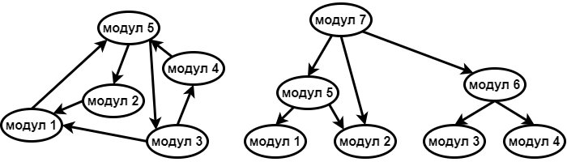

О распоређивању класа у модуле
==============================

.. comment

    Дотаћи ћемо се 
    и појмова тесне и лабаве спрегнутости, које треба имати на уму приликом организовања класа у 
    библиотеке.

Примери које смо видели у овој лекцији су сви и даље релативно мали, па је очигледно како има смисла 
груписати класе у модуле, односно библиотеке. У великом програму то може да буде знатно теже.

За уочавање заокружених целина у великом програму може да буде потребан "поглед из висине", 
односно сагледавање шире слике и размишљање на високом нивоу апстракције. Оно што уме да буде 
тешко при решавању конкретног, сложеног проблема је да умемо "да се измакнемо" и за тренутак 
престанемо да размишљамо само о том проблему. За разлагање проблема и организацију кода је 
веома корисно да препознамо делове који се баве решавањем неких мањих, али општих проблема. 
Такви делови служе као основа, а на њих се надовезује конкретна употреба тих делова као 
надградња. Делови који чине основу су добар кандидат за независне библиотеке, јер лако могу да 
буду потребни и у другим пројектима. Од библиотека које смо видели, овом опису највише одговара 
класа/библиотека ``CoordinateConverter``, која приказује координатни систем и прерачунава координате, 
мада за такву, базичну функционалност има и много бољих примера. 

**Пример -- обрада слике**

Нека је у оквиру неког већег задтака потребно да 
обрадимо слику на одређени начин. У ту сврху ћемо вероватно да користимо неке стандардне алгоритме 
за обраду слике, као што је промена величине слике, конверзија у сиву скалу или бинаризација 
слике, примена одређених филтара и слично. Вероватно ћемо желети и да експериментишемо са 
различитим параметрима алгоритама, различитим редоследом примене филтара итд. У сваком случају, 
логично је да опште алгоритме за обраду слике издвојимо у посебну библиотеку коју бисмо могли да 
назовемо ``ObradaSlike``, јер би та библиотека веома лако могла да буде потребна и у другим 
пројектима. Са друге стране, класе које на специфичан начин користе ове алгоритме су везане за 
проблем који решавамо. Због тога оне нису нарочито важне за друге пројекте и не треба да 
оптерећују претходну библиотеку. Те класе и даље могу да се издвоје у нову, посебну библиотеку, 
која би могла да се зове нпр. ``PronalazenjeObjekata``. Тада би библиотека ``PronalazenjeObjekata`` 
зависила од библиотеке ``ObradaSlike``, а апликација би непосредно зависила од библиотеке 
``PronalazenjeObjekata``, а посредно и од библиотеке ``ObradaSlike``.

Спрегнутост модула
------------------

Како год да разложимо кôд на модуле, неки модули ће да зависе од других. Ова међузависност модула 
најбоље се представља усмереним графом, где модули представљају чворове, а зависности гране графа. 

При разлагању већег пројекта на логичке целине -- модуле, посебно треба водити рачуна о такозваној 
спрегнутости кода (енгл. *code coupling*). Циљ коме се тежи је да граф међузависности модула има што 
једноставнију структуру. На пример, кружне зависности модула (циклуси у усмереном графу) су веома 
непожељне, јер то значи да модули који чине циклус морају сви да буду укључени у сваки пројекат у 
коме учествује макар један од њих. Ово је јасан сигнал да кôд није добро подељен на модуле, јер се 
узајамно зависни модули понашају као један већи, суштински нерастављив модул. У таквом и сличним 
случајевима кажемо да у коду постоји **тесна спрегнутост** (*tight coupling*). Још један непожељан 
случај је да неки модул зависи од великог броја других модула. Таква ситуација је обично сигнал да 
је тај модул превелики, или да је нека класа у њему лоше дизајнирана (има превише функционалности). 

Када је пројекат добро подељен на модуле, кôд је **лабаво спрегнут** (*loose coupling*). У том 
случају граф зависности модула је ацикличан и обично има релативно мали број грана. У ацикличном 
графу чворови могу да се групишу у слојеве. 

    
    Пример лоше, тесне спрегнутости (лево), где сваки модул посредно или непосредно зависи од 
    сваког другог, и добре, лабаве спрегнутости (десно), где постоје слојеви.

Најнижем слоју у графу одговарају модули који не зависе од других модула, и они представљају неку 
базичну функционалност. Модули тог најнижег слоја су обично потпуно независне библиотеке, често 
неке библиотеке опште намене које могу и да се купе или преузму као готове. У том случају кажемо 
да је библиотеке направила тзв. трећа страна (`third party`), тј. независан произвођач софтвера. 
Вишим слојевима одговарају модули који зависе од модула из претходних слојева. 

Број слојева у графу зависности модула не мора да буде велики, могуће је да их буде свега два или 
три чак и у веома великим пројектима. Умеће организовања кода у модуле се између осталог огледа и 
у једноставности добијеног графа зависности, нарочито када он има много чворова.

.. suggestionnote::

    Да би кôд могао да буде боље подељен на модуле, корисно је да су интерфејси, тј. јавни делови тих 
    модула мали. Другим речима, треба избегавати "универзалне", или "сваштарске" библиотеке, које 
    раде све што нам је потребно. 

Неке од предности лабаво спрегнутих модула у пројекту смо већ истакли - такве модуле је знатно 
лакше одвојено тестирати, а и поново искористити у другим пројектима, или другим деловима великог 
пројекта. Поменућемо још једну корист коју имамо од лабаве спрегнутости, а која није тако 
очигледна. Током развоја програма честе су мале измене, после којих желимо да испробамо како 
програм ради. При лабавој спрегнутости, мале измене у коду погађају само мали број (малих) 
модула, тако да се извршиви фајлови (библиотеке и програми) веома брзо формирају. Када у пројекту 
постоје тесно спрегнути модули, они често завршавају у истом извршивом фајлу (статички се линкују), 
па може да се догоди да после измене само једне линије кода линковање траје и по неколико минута.

