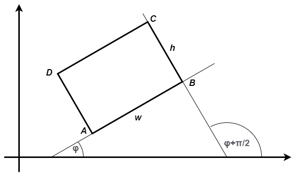

Изведена класа
==============

У овој лекцији:

- шта је наслеђивање и шта њиме добијамо
- могући односи између класа

.. comment

    Добијамо одговор на потребе програмера, које се кратко могу описати речима:
    "треба ми то што већ постоји, али само мало другачије", а да при томе постојећи кôд не мора ни да се мења ни да се копира. 
    
    класе правоугаоник и ротирани правоугаоник.

Наслеђивање је централни, или један од централних концепата објектно оријентисаног програмирања. 
Механизам наслеђивања нам омогућава да направимо нову класу, користећи неку постојећу класу као 
полазну основу. Ту полазну класу називамо **базна класа**, а нову класу **изведена класа**. Када 
помоћу механизма наслеђивања формирамо нову класу на основу постојеће, нова класа одмах садржи 
сву функционалност базне класе, коју може по потреби делимично и да преиначи и/или допуни. 

Да би поља базне класе била доступна у методима изведене класе, довољно је да та поља у базној 
класи буду декларисана као **заштићена** (``protected``) уместо као приватна (``private``).
Тако декларисана поља ће у свим осталим класама (које нису изведене из базне) и даље бити 
недоступна, исто као када их декларишемо као приватна.

.. csv-table:: 
    :header: Ниво приступа, значење
    :widths: 12, 80
    :align: left
    
    private,        "Поља доступна у класи, а недоступна ван класе"
    protected,      "Поља доступна у класи и из ње изведеним класама, а недоступна у осталим класама"
    public,         "Поља доступна свуда у кôду"

У програмирању је честа ситуација да нам постојећи кôд одговара делимично, али не у потпуности. 
Тај исти постојећи кôд неком другом вероватно одговара у потпуности, па не можемо само да га 
преправимо и прилагодимо својим потребама, јер бисмо тиме пореметили рад других програмера. Могли 
бисмо да направимо копију кода који нам је потребан, па да ту копију прилагодимо, али такво решење 
није препоручљиво. Наиме, на такав начин се гомилају веома слични делови кода и програм брзо 
постаје непотребно велики и тежак за одржавање (нпр. исправке грешака и друге будуће измене треба 
уносити на више места у коду) и непрегледан (лако можемо да помешамо у којој од неколико истих или 
сличних функција се налазимо). Боље решење нам доноси управо наслеђивање. Постојећи кôд треба сместити 
у класу, а нову класу треба извести из постојеће. На тај начин постојећи кôд не мора ни да се мења, 
ни да се копира, а ми добијамо класу која је делом иста као нека постојећа, а разликује се у делу 
у коме нам је то потребно. Ово ћемо ускоро да илуструјемо на примерима.

Писање изведене класе
---------------------

**Навођење базне класе**

Јасно је да приликом писања дефиниције изведене класе треба негде да се наведе из које класе се 
изводи та класа, да би компајлер имао све потребне информације за генерисање извршивог кода. Име 
базне класе се наводи након имена изведене класе и двотачке. На пример, ако изводимо класу ``B`` 
из класе ``A``, треба писати:

.. code::

    public class A
    {
        // ...
    }

    public class B : A
    {
        // ...
    }

**Конструктори**

Приликом креирања инстанце изведене класе, потребно је да се иницијализује и онај део објекта 
који постоји и у базној класи. Пошто се то већ дешава у конструктору базне класе (а може да буде 
сложен поступак), било би непрактично да се кôд за иницијализацију основног дела понавља у 
конструктору изведене класе. Стога је механизам наслеђивања осмишљен тако да се при инстанцирању 
изведене класе **увек** прво позива конструктор базне класе, а затим конструктор изведене класе. 
На тај начин нам је омогућено да се конструктором изведене класе само надовежемо на оно што ради 
конструктор базне класе и да његов рад само допунимо (и евентуално модификујемо колико је 
потребно), али не морамо да га понављамо. 

.. comment

    слика са два оквира, један у другом (објекат базне и изведене класе). 
    Поља базне у унутрашњем, а поља изведене у спољашњем оквиру.

Приликом писања консруктора изведене класе, имамо могућност да наведемо који конструктор базне 
класе желимо да се изврши пре њега (а неки мора да се изврши), и са којим аргументима. Аргументе 
конструктора базне класе наводимо након листе аргумената конструктора изведене класе, двотачке и 
кључне речи ``base``, на пример:

.. code::

    public class A
    {
        protected int x;
        public A(int x0) { x = x0; }
        // ...
    }

    public class B : A
    {
        private int y;
        public B(int x0, int y0)
            : base(x0)
        {
            y = y0;
        }
        // ...
    }

Ако базна класа има више конструктора, на основу броја и типа аргумената наведених иза речи 
``base`` се одређује који од њих ће бити изрвршен. Уколико базна класа има и подразумевани 
конструктор (који не користи параметре), део ``: base(<lista ragumenata>)`` можемо и да изоставимо, 
а у том случају ће бити извршен подразумевани консруктор базне класе. Уколико базна класа нема 
подразумевани конструктор, реч ``base`` и листу аргумената морамо да наведемо. 

.. comment

    using System;
    namespace primer
    {
        public class A
        {
            protected int x;
            public A(int x0) { x = x0; }
            public int f() { return x * x; }
            public int g() { return x * x * x; }
        }

        public class B : A
        {
            private int y;
            public B(int x0, int y0)
                : base(x0)
            {
                y = y0;
            }

            new public int g() { return x * x + 1; }
        }
        internal class Program
        {
            static void Main(string[] args)
            {
                A a = new A(5);
                Console.WriteLine(a.f());
                Console.WriteLine(a.g());

                B b = new B(2, 3);
                Console.WriteLine(b.f());
                Console.WriteLine(b.g());
            }
        }
    }

Пример - правоугаоник
---------------------

Претпоставимо да је некоме била потребна класа ``Pravougaonik``, која моделира правоугаоник 
чије су странице паралелне са координатним осама. Такав правоугаоник је потпуно одређен 
координатама једног (нпр. доњег левог) темена и дужинама двеју суседних страница. Према 
томе, ако темена означимо са ``A``, ``B``, ``C``, ``D``, довољно је да од података 
правоугаоник садржи координате ``ax, ay`` темена ``A`` и дужину ``w`` и висину ``h`` 
правоугаоника. 

Интерфејс, тј. јавни део класе могу да чине нпр. методи ``Obim`` и ``Povrisna``, који враћају 
обим и површину правоугаоника, својства ``AX``, ``AY``, ``BX``, ``BY``, ``CX``, ``CY``, 
``DX``, ``DY`` за дохватање координата темена правоугаоника, и на кају својства ``W`` i ``H``, 
за добијање дужине и висине правоугаоника. Та класа је могла да буде написана овако:

.. activecode:: klasa_pravougaonik
    :passivecode: true

    public class Pravougaonik
    {
        protected double w, h;
        protected double ax, ay;
        public Pravougaonik(double w, double h, double ax, double ay)
        {
            this.w = w;
            this.h = h;
            this.ax = ax;
            this.ay = ay;
        }

        public double Obim() { return 2 * w + 2 * h; }
        public double Povrisna() { return w * h; }

        public double W { get { return w; } }
        public double H { get { return h; } }

        public double AX { get { return ax; } }
        public double AY { get { return ay; } }
        public double BX { get { return ax + w; } }
        public double BY { get { return ay; } }
        public double CX { get { return ax + w; } }
        public double CY { get { return ay + h; } }
        public double DX { get { return ax; } }
        public double DY { get { return ay + h; } }
    }

Једино што је у овој класи другачије од класа које смо до сада писали је реч ``protected`` 
испред назива поља која су до сада по правилу била приватна. 

Претпоставимо даље да нам се указала потреба за сличном класом, која допушта да правоугаоник 
буде под углом у односу на координатне осе. За такав правоугаоник, потребно је поред једног 
темена и дужина страница памтити и нпр. угао :math:`\varphi` између позитивног смера `x` осе 
и странице `AB`. 

    
    Ротирани правоугаоник, задат теменом :math:`A`, дужинама страница :math:`w, h` и углом 
    :math:`\varphi`.

Методи ``Obim`` и ``Povrisna`` нам одговарају у постојећем облику, а исто важи и за својства 
``AX``, ``AY``, ``W`` i ``H``. Део који треба променити су дефиниције својстава ``BX``, ``BY``, 
``CX``, ``CY``, ``DX``, ``DY``.

Ако претпоставимо да су дате координате темена :math:`A` и угао :math:`\varphi`, Формуле за 
израчунавање координата осталих темена можемо да изведемо користећи основне тригонометријске 
једнакости и адиционе формуле:

.. math::

    \begin{align} \\
    B_x &= A_x + w \cdot \cos \varphi \\
    B_y &= A_y + w \cdot \sin \varphi \\
    C_x &= B_x + h \cdot \cos \left( {\varphi + \frac{\pi}{2}} \right) 
         = B_x + h \cdot \left( \cos \varphi \cos \frac{\pi}{2} - \sin \varphi \sin \frac{\pi}{2} \right)
         = B_x - h \cdot \sin \varphi \\
    C_y &= B_y + h \cdot \sin \left( {\varphi + \frac{\pi}{2}} \right) 
         = B_x + h \cdot \left( \sin \varphi \cos \frac{\pi}{2} + \cos \varphi \sin \frac{\pi}{2} \right)
         = B_x + h \cdot \cos \varphi \\
    D_x &= AX + w \cdot \cos \left( {\varphi + \frac{\pi}{2}} \right)
         = A_x + h \cdot \left( \cos \varphi \cos \frac{\pi}{2} - \sin \varphi \sin \frac{\pi}{2} \right)
         = A_x - h \cdot \sin \varphi \\
    D_y &= A_y + w \cdot \sin \left( {\varphi + \frac{\pi}{2}} \right)
         = A_x + h \cdot \left( \sin \varphi \cos \frac{\pi}{2} + \cos \varphi \sin \frac{\pi}{2} \right)
         = A_x + h \cdot \cos \varphi \\
    \end{align}    

Пошто координате темена могу да буду потребне више пута, боље је да уместо угла памтимо његов синус и 
косинус, које израчунавамо само једном, у конструктору класе ``RotiraniPravougaonik``. 

Сада класу ``RotiraniPravougaonik`` можемо да напишемо овако:

.. activecode:: klasa_rotirani_pravougaonik
    :passivecode: true

    public class RotiraniPravougaonik : Pravougaonik
    {
        private double sinUgla;
        private double cosUgla;
        public RotiraniPravougaonik(double a, double b, 
            double ax, double ay, double ugao)
            : base(a, b, ax, ay)
        {
            this.sinUgla = Math.Sin(ugao);
            this.cosUgla = Math.Cos(ugao);
        }
        public new double BX { get { return ax + w * cosUgla; } }
        public new double BY { get { return ay + w * sinUgla; } }
        public new double CX { get { return BX - h * sinUgla; } }
        public new double CY { get { return BY + h * cosUgla; } }
        public new double DX { get { return ax - h * sinUgla; } }
        public new double DY { get { return ay + h * cosUgla; } }
    }

**Сакривање члана базне класе**

Приметимо да смо у "преправљеним" верзијама својстава додали кључну реч ``new`` пре типа 
својства. Тиме истичемо да не желимо да користимо стара својства са истим именима, дефинисана 
у базној класи.

Уколико бисмо изоставили кључну реч ``new`` у овим дефиницијама, компајлер би нам упозорењем 
скренуо пажњу на то да овим дефиницијама онемогућавамо употребу претходних истоимених дефиниција 
у објектима изведене класе, тј. сакривамо претходне, наслеђене дефиниције. На пример, ако бисмо 
уместо ``public new double BX`` писали само ``public double BX``, добили бисмо овакво упозорење:

.. code::

    Warning CS0108 'RotiraniPravougaonik.BX' hides inherited member 
    'Pravougaonik.BX'. Use the new keyword if hiding was intended.

.. infonote::

    Дефинисањем члана у изведеној класи, који се зове исто као неки члан базне класе, онемогућили 
    смо употребу тог члана базне класе. Каже се и да смо сакрили одговарајућег истоименог члана 
    базне класе. Због тога из класе ``RotiraniPravougaonik`` не можемо (директно) да користимо 
    својства ``BX``, ``BY``, ``CX``, ``CY``, ``DX``, ``DY`` базне класе, али та својства нам нису 
    ни потребна у изведеној класи (она би за ротирани правоугаоник давала неисправне вредности 
    координата). 

На крају, да бисмо се уверили да су класе ``RotiraniPravougaonik`` и ``Pravougaonik`` исправно 
написане, увек је добро да се оне испробају. Брзу проверу исправности написаних класа можемо да 
изведемо нпр. помоћу следећег кода:

.. activecode:: testiranje_rotiranih_pravougaonika
    :passivecode: true

    internal class Program
    {
        static void Main(string[] args)
        {
            Pravougaonik p = new Pravougaonik(5, 3, 1, 1);
            Console.WriteLine("Duzina(sirina) je {0}, a visina {1}", 
                p.W, p.H);
            Console.WriteLine("Obim je {0}, a povrsina {1}", 
                p.Obim(), p.Povrisna());
            Console.Write("A({0:0.00}, {1:0.00}), ", p.AX, p.AY);
            Console.Write("B({0:0.00}, {1:0.00}), ", p.BX, p.BY);
            Console.Write("C({0:0.00}, {1:0.00}), ", p.CX, p.CY);
            Console.WriteLine("D({0:0.00}, {1:0.00})", p.DX, p.DY);
            Console.WriteLine();

            RotiraniPravougaonik rp = 
                new RotiraniPravougaonik(4, 2, 3, 3, -Math.PI / 6);
            Console.WriteLine("Duzina(sirina) je {0}, a visina {1}", 
                rp.W, rp.H); // preuzeto iz bazne klase
            Console.WriteLine("Obim je {0}, a povrsina {1}", 
                rp.Obim(), rp.Povrisna()); // preuzeto iz bazne klase
            Console.Write("A({0:0.00}, {1:0.00}), ", 
                rp.AX, rp.AY); // preuzeto iz bazne klase
            Console.Write("B({0:0.00}, {1:0.00}), ", rp.BX, rp.BY); // novo
            Console.Write("C({0:0.00}, {1:0.00}), ", rp.CX, rp.CY); // novo
            Console.WriteLine("D({0:0.00}, {1:0.00})", rp.DX, rp.DY); // novo
        }
    }

Програм исписује 

.. code::
       
    Duzina(sirina) je 5, a visina 3
    Obim je 16, a povrsina 15
    A(1.00, 1.00), B(6.00, 1.00), C(6.00, 4.00), D(1.00, 4.00)

    Duzina(sirina) je 4, a visina 2
    Obim je 12, a povrsina 8
    A(3.00, 3.00), B(6.46, 1.00), C(7.46, 2.73), D(4.00, 4.73)

Лако се проверава да су добијене вредности својстава управо оне које је и требало да добијемо за 
дате аргументе конструктора једног и другог правоугаоника.

Једна могућа грешка
-------------------

У претходном прогрмау који проверава исправност класа ``Pravougaonik`` и ``RotiraniPravougaonik``, 
ротирани правоугаоник смо дефинисали овако:

.. code::

    RotiraniPravougaonik rp = new RotiraniPravougaonik(4, 2, 3, 3, -Math.PI / 6);

Програм би могао да се изврши и да смо писали 

.. code::

    Pravougaonik rp = new RotiraniPravougaonik(4, 2, 3, 3, -Math.PI / 6);

Међутим, у овом случају не бисмо добили очекивани резултат. За овако формиран објекат ``rp``, 
писањем ``rp.BX`` бисмо извршили приступник дефинисан у базној класи, и добили бисмо координату 
темена ``B`` као да је правоугаоник поравнат са осама. У ово лако можемо да се уверимо малом 
приверменом преправком (тј. "кварењем") претходног програма.

Декларисање имена ``rp`` помоћу базне класе, а инстанцирање помоћу изведене класе би у овом 
случају била грешка. У лекцији посвећеној динамичком полиморфизму ћемо видети примере у којима 
је ова могућност врло корисна. 

.. comment

    могући односи између класа: користи, агрегира/садржи, наслеђује
    разлика између "агрегира" и "садржи" није битна ако се ослањамо на ђубретарца (нема власника)
