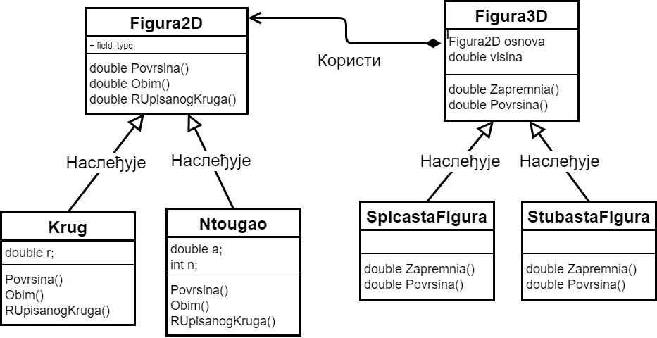

Пример апстрактних метода  и класа
==================================

У овој лекцији:

- Генерализација као техника
- Сложенији пример употребе апстрактних класа и метода

У примеру са обимима и површинама фигура у равни, до решења смо дошли тако што смо прво осмислили 
класе ``Krug`` и ``Ntougao``, а затим уочили да оне имају доста тога заједничког. Заједничке делове 
ових класа смо издвојили у класу ``Figura2D``, која је послужила као базна класа за обе полазне 
класе. Тиме смо применили технику која се зове **генерализација**. 

.. infonote::

    Генерализација је техника издвајања битних карактеристика (најчешће представљених помоћу поља, 
    својства, или метода) из две или више класа у заједничку базну класу. 
    
Можемо да кажемо да су специјализација и генерализација два различита погледа на наслеђивање. У 
случају специјализације полазимо од општије класе и на основу ње креирамо једну или више 
специјализованих класа наследница. Код генерализације је смер размишљања и редослед креирања обрнут -- 
полазимо од специјализованих класа и креирамо општији појам, који служи као базна класа за полазне 
класе.

На примеру који следи проћи ћемо још једном кроз процес генерализације, односно препознавања 
заједничких карактеристика осмишљених класа, да бисмо заједничке делове издвојили у општију, базну 
класу.

Пример -- површине и запремине тела
-----------------------------------

.. questionnote::

    Проширити решење из примера са обимима и површинама фигура у равни и доћи до скупа класа помоћу 
    којег могу да се рачунају површине и запремине ваљка, призме, купе и пирамиде (мисли се на прави 
    ваљак, праву купу, праву правилну призму и праву правилну пирамиду). Илустровати рад тих класа 
    као у претходном примеру.
    
Подсетимо се познатих формула за површину и запремину ваљка и призме: 

.. math::

    \begin{align} \\
    &V_{valjka} = BH,               &   P_{valjka} = 2B + M\\
    &V_{prizme} = BH,               &   P_{prizme} = 2B + M\\
    \end{align}

У овим формулама, :math:`B` је ознака за површину основе, а :math:`M` за површину омотача. Овако 
написане, формуле за ваљак и призму су међусобно потпуно исте. Када још узмемо у обзир да се 
површина омотача и код ваљка и код призме израчунава као производ висине и обима основе, долазимо 
до закључка да ваљак и призму за потребе овог примера можемо да представимо истом класом. Та класа 
треба да садржи само висину као реалан број, и основу којој ће да приступа преко референце на класу 
``Figura2D``, а могла би да изгледа овако, за почетак:

.. code-block:: csharp

    public class StubastaFigura // valjak, prizma
    {
        private Figura2D osnova;
        private double visina;
        public StubastaFigura(Figura2D b, double h)
        {
            osnova = b;
            visina = h;
        }
        public double Zapremina() 
        { 
            return osnova.Povrsina() * visina; 
        }
        public double Povrsina()
        {
            double b = osnova.Povrsina();       // povrsina osnove
            double m = osnova.Obim() * visina;  // povrsina omotaca
            return b + b + m;
        }
    }

Погледајмо сада и формуле за површину и запремину купе и пирамиде.

.. math::

    \begin{align} \\
    &V_{kupe} = \frac{1}{3}BH,      &   P_{kupe} = B + M\\
    &V_{piramide} = \frac{1}{3}BH,  &   P_{piramide} = B + M\\
    \end{align}

Видимо да су и формуле за купу и пирамиду такође међусобно потпуно исте. 
Површина омотача купе се рачуна као :math:`M = \frac{1}{2} O \cdot s`, где је :math:`O` обим (кружне) 
основе, а :math:`s` дужина изводнице. У случају пирамиде, формула за површину омотача је слична: 
:math:`M = \frac{1}{2} O \cdot h`, где је :math:`O` поново обим (овај пут многоугаоне) основе, а 
:math:`h` је висина бочне стране (апотема). Да ли ова разлика захтева посебне класе за купу и 
пирамиду? Одговор зависи од тога шта од података желимо да памтимо за ова тела. Ако, по угледу на 
ваљак и призму, памтимо само основу и висину, онда треба да израчунамо изводницу, односно висину 
бочне стране. Изводница купе се рачуна по формули :math:`s = \sqrt{r^2 + H^2}`. Висина :math:`h` бочне 
стране пирамиде се рачуна по истој формули, :math:`h = \sqrt{r^2 + H^2}`, с тим да :math:`r` код 
пирамиде означава полупречник круга уписаног у многоугаону основу, а то је величина коју већ 
израчунавамо у класи ``Ntougao`` (погледајте претходни пример, метод ``Povrsina``). Зато је довољно 
да у апстрактну класу ``Figura2D`` додамо и апстрактан метод ``RUpisanogKruga``. Формулу за 
полупречник уписаног круга многоугла већ имамо, а за круг је то сâм полупречник круга. Према томе, 
за рачунање површине и запремине купе и пирамиде можемо да планирамо класу попут ове:

.. code-block:: csharp

    public class SpicastaFigura // kupa, piramida
    {
        private Figura2D osnova;
        private double visina;
        public SpicastaFigura(Figura2D b, double h)
        {
            osnova = b;
            visina = h;
        }
        public double Zapremina() { return osnova.Povrsina() * visina / 3; }
        public double Povrsina()
        {
            double b = osnova.Povrsina();
            double r = osnova.RUpisanogKruga();
            double s = Math.Sqrt(r * r + visina * visina); // izvodnica, ili visina bočne strane
            double m = 0.5 * osnova.Obim() * s; // omotač
            return b + m;
        }
    }

Поново имамо две сличне класе, које намеравамо да користимо на униформан начин. Зато постављамо себи 
питање како би могла да изгледа заједничка базна класа за две назначене класе. Као прво, поља 
``osnova`` и ``visina`` могу да буду заштићена поља базне класе, пошто су потребна за рачунање 
површина и запремина сва четири поменута тела. Даље, методи ``Zapremina`` и ``Povrsina`` могу да 
буду апстрактни методи базне класе, због чега ће и цела класа да буде апстрактна. Ево како би она 
могла да изгледа: 

.. code-block:: csharp

    public abstract class Figura3D
    {
        protected Figura2D osnova;
        protected double visina;
        public Figura3D(Figura2D b, double h)
        {
            osnova = b;
            visina = h;
        }
        public abstract double Zapremina();
        public abstract double Povrsina();
    }

Закључујемо да су нам у програму довољне следеће две мале хијерархије класа: 

- Базна класа прве хијерархије је апстрактна класа ``Figura2D`` (дводимензиона фигура), из које су изведене 
  класе ``Krug`` и ``Ntougao``. Ове класе су незнатно измењене у односу на претходни пример, јер им је додат 
  метод ``RUpisanogKruga()``.
- Базна класа друге хијерархије је апстрактна класа ``Figura3D``  (тродимензиона фигура), из које су изведене 
  класе ``SpicastaFigura`` (која може да представља купу или пирамиду) и ``StubastaFigura`` (која може да 
  представља ваљак или призму). Тродимензиона фигура садржи дводимензиону фигуру као своју основу.

    Однос класа које се појављују у примеру, са означеним генерализацијама (однос базне и изведене класе) и 
    агрегацијама (однос у коме једна класа садржи референцу на другу).

Класе ``StubastaFigura`` и ``SpicastaFigura`` треба прилагодити идеји да су оне изведене из класе ``Figura3D``.
То подразумева неколико малих измена. Прво, треба додати ``: Figura3D`` иза имена класе, треба прилагодити 
конструкторе, уклонити поља ``osnova`` и ``visina`` и испред имена метода додати реч ``override``.

Ево како после свих ових измена изгледа цео програм.

.. activecode:: klase_povrsine_zapremine
    :passivecode: true
    :includesrc: src/primeri/aps_povrsina_zapremina.cs

Програм исписује

.. code::

    Figura: P=282.74, V=314.16
    Figura: P=835.66, V=1847.26
    Figura: P=161.28, V=120.00
    Figura: P=140.78, V=103.92
    Za boju Color [Red] ukupna povrsina je 444.03, a zapremina 434.16
    Za boju Color [Green] ukupna povrsina je 835.66, a zapremina 1847.26
    Za boju Color [Blue] ukupna povrsina je 140.78, a zapremina 103.92

Ово је нови пример **динамичког полиморфизма**. Употребом апстрактних метода за површину и запремину 
постигли смо да свака фигура "зна" како се израчунава њена површина, односно запремина. Зато нема 
потребе да на месту где се објекти користе водимо рачуна о томе која је фигура ког облика. 
