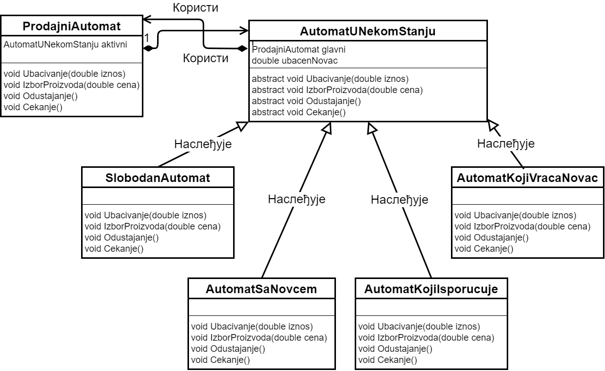

Напреднији пример хијерархије класа
===================================

Понекад су објекти које желимо да моделујемо у нашим програмима прилично сложени, па би представљање 
таквих објеката једном класом могло да доведе до релативно сложених метода и гломазних класа. У 
таквом случају, стваран објекат може да се моделује групом класа, од којих свака описује само 
одређени део функционалности тог објекта. При томе инстанце појединих класа не морају да представљају 
нешто што постоји као такво у стварности, већ могу да буду и корисне фикције чија је сврха само да 
разложе сложеност стварних објеката на једноставније целине.  

Пример -- продајни аутомат
--------------------------

.. questionnote::

    Нека је потребно моделовати рад продајног аутомата (`vending machine`). Од корисника аутомата се 
    очекује да најпре једном или више пута убаци новац, након чега може да одустане и добије новац назад 
    или да изабере производ. Ако изабере производ, корисник треба да сачека на испоруку, а затим, ако је 
    убацио више новца неко што производ кошта, треба да сачека и кусур. Тиме је једна куповина завршена и 
    може да започне друга. 
    
    Аутомат који моделујемо не уме да понуди купца да за преостали новац изабере још неки производ, или 
    да на износ који је већ у аутомату дода још новца и онда изабере производ. 

    Уколико акције корисника нису у очекиваном редоследу, аутомат треба да прикаже прикладну поруку. 

Међу акцијама корисника на које аутомат треба да реагује препознајемо убацивање новца, избор производа, 
одустајање од куповине и чекање. Према томе, можемо да планирамо класу ``Automat`` са следећим јавним 
методима. 

.. code-block:: csharp

    public void Ubacivanje(double iznos) { ... }
    public void IzborProizvoda(double cena) { ... }
    public void Odustajanje() { ... }
    public void Cekanje() { ... }

Јасно је да понашање аутомата на дату акцију корисника зависи од претходних акција корисника. На пример, 
ако корисник прво притисне дугме за одустајање, аутомат треба једноставно да игнорише ту акцију уз 
приказ одговарајуће поруке, јер корисник нема од чега да одустане. Међутим, ако је пре одустајања 
корисник убацио новац, аутомат треба да му врати тај новац. 

Да би аутомат на сваку акцију корисника у сваком тренутку правилно реаговао, корисно је да се уведе 
нека променљива, тј. приватно поље које памти стање у коме се аутомат тренутно налази, односно фазу у 
процесу продаје једног производа. На пример, аутомат је на почетку слободан и очекује убацивање новца. 
Након убацивања новца, аутомат је у фази у којој очекује избор производа или одустајање. Након извора 
производа, аутомат је у фази испоруке изабраног производа, а на крају, ако је потребно, у фази враћања 
кусура. Овде треба разумети да у свакој фази, односно сваком стању, аутомат треба да уме да адекватно 
реагује на сваку акцију корисника, била она очекивана или не. 

На основу овог разматрања можемо да уведемо поље ``status`` на следећи начин:

.. code-block:: csharp

    private enum Status { Slobodan, PrimioNovac, Isporucuje, VracaKusur };
    private Status status;

Сада свако реаговање на акцију корисника, односно сваки од четири поменута метода почиње испитивањем 
тренутног статуса. У зависности од тренутног статуса, аутомат предузима одговарајућу акцију и по 
потреби прелази у неки други статус. Прва верзија решења може да изгледа овако. 

**Продајни аутомат -- прва верзија**

.. activecode:: prodajni_automat_0_uvodni
    :passivecode: true
    :includesrc: src/primeri/design_patterns/prodajni_automat/prodajni_automat_0_uvodni.cs

Видимо да су методи који регаују на акције корисника релативно сложени, јер морају да воде рачуна о 
тренутном стању аутомата. Када бисмо знали у којем стању је аутомат, методи би били знатно једноставнији. 

У ствари, ми можемо за свако стање продајног аутомата да напишемо по једну класу, која представља рад 
аутомата када је у том стању. Због очигледне сличности тих класа, генерализацијом долазимо до њихове 
апстрактне базне класе ``AutomatUNekomStanju``. Продајни аутомат би могао да садржи референцу на 
аутомат у неком стању, која би указивала на једноставнији аутомат у одговарајућем стању. При таквом 
дизајну, продајни аутомат би реаговање на акције корисника једноставно делегирао свом под-аутомату 
који представља аутомат у тренутно актуелном стању. 

.. code-block:: csharp

    public class ProdajniAutomat
    {
        public AutomatUNekomStanju aktivni;

        public ProdajniAutomat() { aktivni = new SlobodanAutomat(this, 0); }

        public void Ubacivanje(double iznos) { aktivni.Ubacivanje(iznos); }
        public void IzborProizvoda(double cena) { aktivni.IzborProizvoda(cena); }
        public void Odustajanje() { aktivni.Odustajanje(); }
        public void Cekanje() { aktivni.Cekanje(); }
    }

За сваку од класа изведених из класе ``AutomatUNekomStanju`` лако можемо да напишемо једноставније 
и краће методе за реаговање на акције корисника. Остаје још само да видимо како цео механизам 
прелази из једног стања у друго. Ради тога је потребно да и класе које представљају аутомате у 
одређеном стању имају референцу на главни аутомат (``ProdajniAutomat``), који је једини видљив 
програмеру који користи аутомат. 

    Продајни аутомат -- однос класа (UML дијаграм)

На тај начин помоћни аутомат може да каже главном аутомату "ја те више не представљам, замени ме 
овим објектом, који представља твоје ново стање". На пример, када слободан аутомат прими новац, 
он преко свог поља ``glavni`` може овако да постави нови активни под-аутомат у главном аутомату.

.. code-block:: csharp

    public class SlobodanAutomat : AutomatUNekomStanju
    {
        // ...

        public override void Ubacivanje(double iznos)
        {
            ubacenNovac = iznos;
            glavni.aktivni = new AutomatSaNovcem(glavni, ubacenNovac);
            Console.WriteLine("Ukupno ubaceno {0}, izaberi proizvod", ubacenNovac);
        }

        // ...
    }
    
Слично се дешава и када се прелази из стања испоруке у стање враћања новца, или при било ком 
другом прелазу из једног стања у друго. 

.. suggestionnote::

    Овакав начин мењања поља ``aktivni`` у главном продајном аутомату захтева да оно буде јавно, 
    што није најбоље решење. Боље решење је да се класа ``AutomatUNekomStanju`` и све из ње 
    изведене класе сместе унутар класе ``ProdajniAutomat`` као њени приватни делови. На тај начин, 
    ове класе постају недоступне свуда ван класе ``ProdajniAutomat``, а добијају приступ другим 
    приватним деловима класе ``ProdajniAutomat`` која их садржи. У овом случају нам управо то 
    и одговара.

.. code-block:: csharp

    public class ProdajniAutomat
    {
        abstract public class AutomatUNekomStanju { ... }
        private class SlobodanAutomat : AutomatUNekomStanju { ... }
        private class AutomatSaNovcem : AutomatUNekomStanju { ... }
        private class AutomatKojiIsporucuje : AutomatUNekomStanju { ... }
        private class AutomatKojiVracaNovac : AutomatUNekomStanju { ... }
    
        private AutomatUNekomStanju aktivni;

        public ProdajniAutomat() { aktivni = new SlobodanAutomat(this, 0); }

        public void Ubacivanje(double iznos) { aktivni.Ubacivanje(iznos); }
        public void IzborProizvoda(double cena) { aktivni.IzborProizvoda(cena); }
        public void Odustajanje() { aktivni.Odustajanje(); }
        public void Cekanje() { aktivni.Cekanje(); }
    }

Ево како би могла да изгледа друга верзија решења.

**Продајни аутомат -- друга верзија**

.. activecode:: prodajni_automat_2_resenje
    :passivecode: true
    :includesrc: src/primeri/design_patterns/prodajni_automat/prodajni_automat_2_resenje.cs

Можемо да приметимо да је други програм нешто дужи, али да су сви методи у њему краћи и 
једноставнији. Дакле, увођењем фиктивних објеката који представљају аутомат у одређеним стањима, 
тј. у одређеним фазама једне продаје, постигли смо да у програму више нема посебно сложених метода. 
У релативно малом примеру као што је овај, то и није било неопходно. Међутим, када моделирамо врло 
сложен објекат, ово је један од начина да избегнемо високу сложеност кода на појединим местима, тако 
што функционалност сложене класе распоредимо у неколико једноставнијих класа, које заједно моделирају 
тај сложени објекат. 
