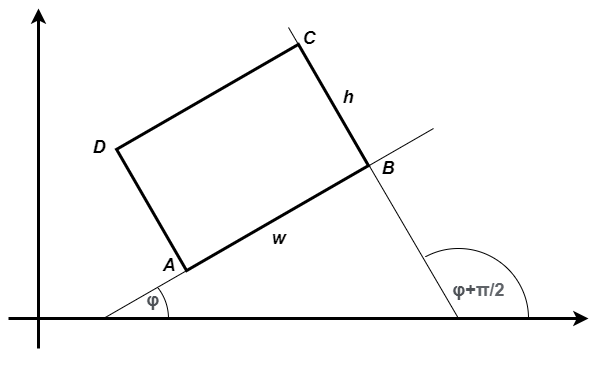

Виртуелни методи
================

У овој лекцији:

- Различити начини модификовања базне класе
- Шта нам доносе (зашто су корисни) виртуелни методи
- Шта је динамички полиморфизам
- Како се пишу и употребљавају виртуелни методи

Модификација базне класе
------------------------

.. comment

    Сакривање чланова базне класе

У претходним лекцијама илустровано је како изведена класа може **да прошири** базну увођењем нових 
чланова (поља, својстава и метода). На пример, у класи ``Namirnica`` која наслеђује класу ``Proizvod`` 
уведено је ново поље ``rokTrajanja``, као и својство ``RokTrajanja``, која представљају проширење 
базне класе. Слично томе, у класи ``Autobus`` која наслеђује класу ``Vozilo``, уведени су методи 
``Ulaz``, ``Izlaz``, поља ``brSedista``, ``brPutnika`` и својства ``BrPutnika``, ``BrSlobodnihMesta``. 
Видели смо да објекат изведене класе у том случају може да се користи на исти начин као и објекат 
базне класе, а може и на неке нове начине, који за базну класу најчешће не би имали смисла, или не 
би били једнако важни, па нису ни уведени у базну класу (нпр. рок трајања има више смисла ако је 
производ прехрамбени, тј. намирница). 

Такође смо видели да базна класа не мора да садржи дефиниције свих својих метода, већ поједини методи 
могу да се дефинишу тек у изведеним класама, и при томе у свакој изведеној класи другачије. Дефинисање 
апстрактних метода у изведеним класама можемо да схватимо као другачију врсту проширења базне класе, 
јер додајемо дефиниције које у базној класи не постоје. 

Осим што можемо да је проширимо, кроз механизам наслеђивања можемо и да **модификујемо** базну класу, 
тј. да променимо њено понашање. То значи да неке методе и својства који су дефинисани у базној класи, 
можемо да дефинишемо другачије у изведеној класи. 

.. suggestionnote::

    Модификовање базне класе је осетљивији поступак него њено проширивање. Сама чињеница да ћемо 
    у базној и изведеној класи имати истоимене чланове (најчешће својства и методе) отвара могућност 
    погрешне употребе. На пример, може да се догоди да желимо да покренемо метод изведене класе, а 
    да се уместо њега покрене истоимени метод базне класе. Зато је важно да се добро разуме сематника 
    (значење, ефекти) различитих начина модификовања базне класе.
    
У следећем примеру понашање базне класе је промењено на начин који се не препоручује, јер може да 
доведе до различитих грешака. У наставку ћемо видети бољи начин да модификујемо базну класу.

Пример - правоугаоник
^^^^^^^^^^^^^^^^^^^^^

Претпоставимо да је некоме била потребна класа ``Pravougaonik``, која моделира правоугаоник чије 
су странице паралелне са координатним осама. Такав правоугаоник је потпуно одређен координатама 
једног (нпр. доњег левог) темена и дужинама двеју суседних страница. Према томе, ако темена 
означимо са ``A``, ``B``, ``C``, ``D``, довољно је да правоугаоник од података садржи координате 
``ax, ay`` темена ``A`` и дужину ``w`` и висину ``h`` правоугаоника. 

Интерфејс, тј. јавни део класе могу да чине нпр. методи ``Obim`` и ``Povrisna``, који враћају 
обим и површину правоугаоника, својства ``AX``, ``AY``, ``BX``, ``BY``, ``CX``, ``CY``, 
``DX``, ``DY`` за дохватање координата темена правоугаоника, и на крају својства ``W`` i ``H``, 
за добијање дужине и висине правоугаоника. Та класа је могла да буде написана овако:

.. activecode:: klasa_pravougaonik
    :passivecode: true

    public class Pravougaonik
    {
        protected double w, h;
        protected double ax, ay;
        public Pravougaonik(double w, double h, double ax, double ay)
        {
            this.w = w;
            this.h = h;
            this.ax = ax;
            this.ay = ay;
        }

        public double Obim() { return 2 * w + 2 * h; }
        public double Povrisna() { return w * h; }

        public double W { get { return w; } }
        public double H { get { return h; } }

        public double AX { get { return ax; } }
        public double AY { get { return ay; } }
        public double BX { get { return ax + w; } }
        public double BY { get { return ay; } }
        public double CX { get { return ax + w; } }
        public double CY { get { return ay + h; } }
        public double DX { get { return ax; } }
        public double DY { get { return ay + h; } }
    }

Претпоставимо даље да нам се указала потреба за сличном класом, која допушта да правоугаоник буде 
под углом у односу на координатне осе. За такав правоугаоник, потребно је поред коордианта једног 
темена и дужина страница памтити и нпр. угао :math:`\varphi` између позитивног смера `x` осе и 
странице `AB`. 

    
    Ротирани правоугаоник, задат теменом :math:`A`, дужинама страница :math:`w, h` и углом 
    :math:`\varphi`.

Методи ``Obim`` и ``Povrisna`` нам одговарају у постојећем облику, а исто важи и за својства 
``AX``, ``AY``, ``W`` i ``H``. Део који треба променити су дефиниције својстава ``BX``, ``BY``, 
``CX``, ``CY``, ``DX``, ``DY``.

Ако претпоставимо да су дате координате темена :math:`A` и угао :math:`\varphi`, Формуле за 
израчунавање координата осталих темена можемо да изведемо користећи основне тригонометријске 
једнакости и адиционе формуле:

.. math::

    \begin{align} \\
    B_x &= A_x + w \cdot \cos \varphi \\
    B_y &= A_y + w \cdot \sin \varphi \\
    C_x &= B_x + h \cdot \cos \left( {\varphi + \frac{\pi}{2}} \right) 
         = B_x + h \cdot \left( \cos \varphi \cos \frac{\pi}{2} - \sin \varphi \sin \frac{\pi}{2} \right)
         = B_x - h \cdot \sin \varphi \\
    C_y &= B_y + h \cdot \sin \left( {\varphi + \frac{\pi}{2}} \right) 
         = B_x + h \cdot \left( \sin \varphi \cos \frac{\pi}{2} + \cos \varphi \sin \frac{\pi}{2} \right)
         = B_x + h \cdot \cos \varphi \\
    D_x &= AX + w \cdot \cos \left( {\varphi + \frac{\pi}{2}} \right)
         = A_x + h \cdot \left( \cos \varphi \cos \frac{\pi}{2} - \sin \varphi \sin \frac{\pi}{2} \right)
         = A_x - h \cdot \sin \varphi \\
    D_y &= A_y + w \cdot \sin \left( {\varphi + \frac{\pi}{2}} \right)
         = A_x + h \cdot \left( \sin \varphi \cos \frac{\pi}{2} + \cos \varphi \sin \frac{\pi}{2} \right)
         = A_x + h \cdot \cos \varphi \\
    \end{align}    

Пошто координате темена могу да буду потребне више пута, боље је да уместо угла памтимо његов синус и 
косинус, које израчунавамо само једном, у конструктору класе ``RotiraniPravougaonik``. 

Сада класу ``RotiraniPravougaonik`` можемо да напишемо овако:

.. activecode:: klasa_rotirani_pravougaonik
    :passivecode: true

    public class RotiraniPravougaonik : Pravougaonik
    {
        private double sinUgla;
        private double cosUgla;
        public RotiraniPravougaonik(double a, double b, 
            double ax, double ay, double ugao)
            : base(a, b, ax, ay)
        {
            this.sinUgla = Math.Sin(ugao);
            this.cosUgla = Math.Cos(ugao);
        }
        public new double BX { get { return ax + w * cosUgla; } }
        public new double BY { get { return ay + w * sinUgla; } }
        public new double CX { get { return BX - h * sinUgla; } }
        public new double CY { get { return BY + h * cosUgla; } }
        public new double DX { get { return ax - h * sinUgla; } }
        public new double DY { get { return ay + h * cosUgla; } }
    }

**Сакривање члана базне класе**

Приметимо да смо у "преправљеним" верзијама својстава додали кључну реч ``new`` пре типа 
својства. Тиме истичемо да не желимо да користимо стара својства са истим именима, дефинисана 
у базној класи.

Уколико бисмо изоставили кључну реч ``new`` у овим дефиницијама, компајлер би нам упозорењем 
скренуо пажњу на то да овим дефиницијама онемогућавамо (директну) употребу претходних истоимених 
дефиниција у објектима изведене класе, тј. сакривамо претходне, наслеђене дефиниције. На пример, 
ако бисмо уместо ``public new double BX`` писали само ``public double BX``, добили бисмо овакво 
упозорење:

.. code::

    Warning CS0108 'RotiraniPravougaonik.BX' hides inherited member 
    'Pravougaonik.BX'. Use the new keyword if hiding was intended.

.. infonote::

    Дефинисањем члана у изведеној класи, који се зове исто као неки члан базне класе, онемогућили 
    смо (директну) употребу тог члана базне класе. Каже се и да смо сакрили одговарајућег истоименог 
    члана базне класе. Због тога из класе ``RotiraniPravougaonik`` не можемо да користимо својства 
    ``BX``, ``BY``, ``CX``, ``CY``, ``DX``, ``DY`` базне класе наводећи само њихова имена, али та 
    својства нам нису ни потребна у изведеној класи (она би за ротирани правоугаоник давала 
    неисправне вредности координата). 

.. comment

    Пример употребе сакривеног члана ``n`` из базне класе навођењем "пуног имена" члана
    
    .. activecode:: sakrivanje_imena3
        :passivecode: true
        :includesrc: src/primeri/nasl_sakrivanje_imena3.cs

    .. code::

        A.F: n = 5
        B.F: n = 10
        B.G: n = 5

Да бисмо се уверили да су класе ``RotiraniPravougaonik`` и ``Pravougaonik`` исправно написане, 
увек је добро да се оне испробају. Брзу проверу исправности написаних класа можемо да изведемо 
нпр. помоћу следећег кода:

.. activecode:: testiranje_rotiranih_pravougaonika
    :passivecode: true

    internal class Program
    {
        static void Main(string[] args)
        {
            Pravougaonik p = new Pravougaonik(5, 3, 1, 1);
            Console.WriteLine("Duzina(sirina) je {0}, a visina {1}", 
                p.W, p.H);
            Console.WriteLine("Obim je {0}, a povrsina {1}", 
                p.Obim(), p.Povrisna());
            Console.Write("A({0:0.00}, {1:0.00}), ", p.AX, p.AY);
            Console.Write("B({0:0.00}, {1:0.00}), ", p.BX, p.BY);
            Console.Write("C({0:0.00}, {1:0.00}), ", p.CX, p.CY);
            Console.WriteLine("D({0:0.00}, {1:0.00})", p.DX, p.DY);
            Console.WriteLine();

            RotiraniPravougaonik rp = 
                new RotiraniPravougaonik(4, 2, 3, 3, -Math.PI / 6);
            Console.WriteLine("Duzina(sirina) je {0}, a visina {1}", 
                rp.W, rp.H); // preuzeto iz bazne klase
            Console.WriteLine("Obim je {0}, a povrsina {1}", 
                rp.Obim(), rp.Povrisna()); // preuzeto iz bazne klase
            Console.Write("A({0:0.00}, {1:0.00}), ", 
                rp.AX, rp.AY); // preuzeto iz bazne klase
            Console.Write("B({0:0.00}, {1:0.00}), ", rp.BX, rp.BY); // novo
            Console.Write("C({0:0.00}, {1:0.00}), ", rp.CX, rp.CY); // novo
            Console.WriteLine("D({0:0.00}, {1:0.00})", rp.DX, rp.DY); // novo
        }
    }

Програм исписује 

.. code::
       
    Duzina(sirina) je 5, a visina 3
    Obim je 16, a povrsina 15
    A(1.00, 1.00), B(6.00, 1.00), C(6.00, 4.00), D(1.00, 4.00)

    Duzina(sirina) je 4, a visina 2
    Obim je 12, a povrsina 8
    A(3.00, 3.00), B(6.46, 1.00), C(7.46, 2.73), D(4.00, 4.73)

Лако се проверава да су добијене вредности својстава управо оне које је и требало да добијемо за 
дате аргументе конструктора једног и другог правоугаоника.

Могуће грешке при употреби изведене класе
-----------------------------------------

Као што је речено на почетку, овакав начин модификовања базне класе се не препоручује, јер може 
да доведе до различитих грешака. Овде ћемо да поменемо неке типичне грешке при употреби изведене 
класе која на овај начин модификује базну класу. Успут појашњавамо и семантику приступања члановима 
класе, тј. начин на који се при оваквој модификацији базне класе одређује да ли ће се приступити 
члановима базне или изведене класе. На тај начин постаје јасније зашто је одређена употреба објеката 
неправилна и зашто доводи до грешке.

.. suggestionnote::

    Ако базну класу модификујемо на горе описани начин, приликом приступања објекту изведене класе 
    преко референце на базну класу можемо да добијемо неисправан резултат! 
    
На пример, ако програму за проверу исправности додамо следећа два реда на сам крај

.. code-block:: csharp

        p = rp;
        Console.WriteLine("B({0:0.00}, {1:0.00})", p.BX, p.BY);

програм би на крају још исписао

.. code::

    B(7.00, 3.00)

што не одговара тачки :math:`B` ниједног од два правоугаоника. Заиста, као што смо већ видели, тачка 
:math:`B` првог правоугаоника има координате :math:`B(6.00, 1.00)` а другог :math:`B(6.46, 1.00)`. 
Уз мало додатне анализе, можемо да приметимо да су за податке другог, ротираног правоугаоника 
израчунате координате тачке :math:`B` као да он није ротиран. То значи да се над подацима из изведене 
класе извршио приступник ``get`` својстава ``BX`` и ``BY`` базне класе, који "не зна" да је реч о 
ротираном правоугаонику.

Да бисмо разумели зашто се овде извршавају приступници базне класе, истакнимо следеће чињенице. 

- У овом примеру ми ни на који начин нисмо назанчили у коду да желимо да се стваран тип одређује 
  у време извршавања, као што је то случај код апстрактних метода. Према томе, одлука о томе који 
  приступник ``get`` својстава ``BX`` и ``BY`` треба да се изврши мора да се донесе у време компајлирања 
  програма. 
- У неким ситуацијама компајлер не може да зна стваран тип објекта на који указује референца ``p2``, 
  јер додељивање референци може да се налази у наредби гранања, као што показује следећи пример.

.. code-block:: csharp

    Pravougaonik p2;
    Console.WriteLine("Da li da napravim obican ili rotirani pravougaonik?");
    string odgovor = Console.ReadLine();

    if (odgovor == "obican")
        p2 = new Pravougaonik(1, 1, 0, 0);
    else
        p2 = new RotiraniPravougaonik(5, 5, 0, 0, Math.PI/4);

    Console.WriteLine("Tacka B je B({0:0.00}, {1:0.00}), ", p2.BX, p2.BY);

Овде стваран тип објекта зависи од уноса корисника, па је јасно да у време комплајлирања програма не 
знамо (а не зна ни компајлер) ког стварног типа ће бити објекат на који указује референца ``p2``. 
Пошто **компајлер у принципу не може да зна стваран тип објекта**, он и не покушава да га одреди, већ 
за разрешавање позива својстава ``p2.BX`` и ``p2.BY`` **користи тип референце**, а то је класа 
``Pravougaonik``, што нам у овом случају не одговара. 

.. reveal:: dugme_detaljnije_objasnjenje1
    :showtitle: Детаљније објашњење
    :hidetitle: Сакриј детаљније објашњење

    **Детаљније објашњење**
    
    Приступници својстава садрже неке наредбе, што значи да су приступници ``get`` или ``set`` у 
    суштини функције, као што су то и методи. Можемо да кажемо да на месту употребе својства имају 
    синтаксу поља, али семантику метода. При генерисању извршивог кода за позив функције, било да 
    је реч о приступнику неког својства или методу, компајлер адресу те функције уграђује у машинску 
    инструкцију за позивање функције. Пошто је једина информација којом компајлер располаже тип 
    референце, он узима адресе функција (у нашем примеру приступника ``get`` својстава ``BX`` и 
    ``BY``) из класе која одговара референци.

.. suggestionnote::

    Приступ преко референце на базну класу није једини начин да добијемо погрешан резултат. До 
    проблема може да дође и када неки базни метод користи друге методе или својства, која су на 
    описани начин модификована у изведеној класи.
    
Претпоставимо да је у базној класи био дефинисан и метод који враћа текстуалну репрезентацију 
правоугаоника.

.. code-block:: csharp

    public override string ToString()
    {
        string f = "[({0:0.00}, {1:0.00}), ({2:0.00}, {3:0.00}), " 
            + "({4:0.00}, {5:0.00}), ({6:0.00}, {7:0.00})]";
        return string.Format(f, AX, AY, BX, BY, CX, CY, DX, DY);
    }

Очекивали бисмо да ова функција даје исправну текстуалну репрезентацију и за поравнате и за ротиране 
правоугаонике. Међутим, чак и када ротираном правоугаонику приступамо преко референце на његову 
класу ``RotiraniPravougaonik``, употребом овог метода добијамо неисправан одговор. Конкретније, 
поново се на податке из изведене класе (ротираног правоугаоника) примењују приступници из базне 
класе (поравнатог правоугаоника), чиме се добијају бесмислене координате које не одговарају ниједној 
стварној тачки. Зашто је то тако?

Метод ``ToString`` у себи има уграђене позиве приступника својстава, а пошто је метод дефинисан у 
базној класи ``Pravougaonik``, у извршивом коду овог метода фиксирани су позиви приступника базне 
класе. 

.. reveal:: dugme_detaljnije_objasnjenje2
    :showtitle: Детаљније објашњење
    :hidetitle: Сакриј детаљније објашњење

    **Детаљније објашњење**

    Метод ``ToString`` позива приступнике својстава, чије наредбе се налазе на некој адреси у 
    меморији. Компајлер је у метод ``ToString`` морао да угради позиве приступника користећи неке 
    конкретне адресе. Будући да је метод ``ToString`` дефинисан у базној класи ``Pravougaonik``, 
    искоришћене су адресе приступника базне класе. 

Други описани проблем бисмо могли да заобиђемо тако што поновимо дефиницију метода ``ToString`` 
у изведеној класи, али то решење је лоше из више разлога. Као прво, базна класа може да има више 
метода који користе својства и методе које смо модификовали у изведеној класи. У том случају, сви 
ти методи базне класе морали би такође да се копирају у изведену класу. Тиме се губи основна корист 
од наслеђивања, које треба да нам омогући да без копирања кода употребљавамо функционалност базне 
класе. Као друго, и даље остаје могуће да добијемо погрешан резултат ако објекат користимо преко 
референце на базну класу.

На следећој страни ћемо видети како да превазиђемо ове проблеме и дођемо до још неких погодности 
које нам доноси наслеђивање.
