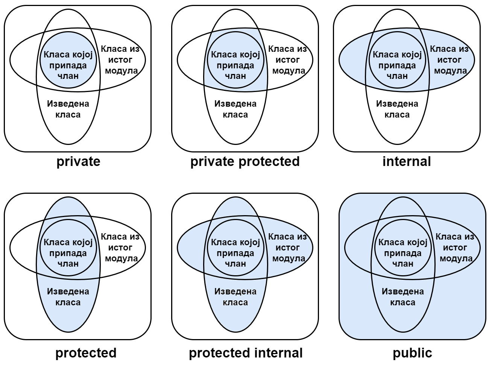

Динамички полиморфизам - примери
================================

У овом поглављу дати су нешто обимнији, решени примери, који илуструју употребу динамичког 
полиморфизма и других концепата о којима смо говорили. У апликацијама које следе користе се 
и библиотеке класа. Раније смо видели да се са употребом библиотека појављује могућност да 
чланови (поља, методи итд.) неке класе буду доступни класама у библиотеци, а недоступни 
класама ван библиотеке. Та могућност се остварује помоћу речи ``internal``.

Са наслеђивањем и хијерархијама класа појавио се нови тип доступности чланова. То су чланови 
доступни у изведеним класама, а недоступни у осталим класама. Овај ниво приступа се добија 
помоћу речи ``protected``. 

Поставља се питање каква је видљивост (доступност) класа и њихових чланова када се наслеђивање 
комбинује са употребом библиотека. Да одговор на то питање не бисмо везивали за конкретне примере 
у којима се користе и библиотеке и наслеђивање, овде ћемо да појаснимо могуће нивое приступа. 

Следећа табела даје преглед нивоа приступа који могу да се задају за класе и њихова поља, 
укрштених са могућим положајима дате класе и њених поља у односу на друге класе. На тај начин 
видимо са којих места у коду су доступне одређене класе и њихови чланови, у зависности од 
наведеног нивоа приступа. 

.. csv-table:: 
    :header: **Место употребе**, ``public``, ``protected internal``, ``protected``, ``internal``, ``private protected``, ``private``
    :widths: 20, 10, 10, 10, 10, 10, 10
    :align: left

    **Унутар класе**,                         ✅, ✅, ✅, ✅, ✅, ✅
    **Унутар изведених класа (исти модул)**,  ✅️, ✅, ✅, ✅, ✅, ❌
    **Унутар осталих класа (исти модул)**,    ✅️, ✅, ❌, ✅, ❌, ❌
    **Унутар изведених класа (други модул)**, ✅️, ✅, ✅, ❌, ❌, ❌
    **Унутар осталих класа (други модул)**,   ✅️, ❌, ❌, ❌, ❌, ❌

Исте информације представљене су и помоћу слике.

    
    Доступност чланова класе у другим класама, зависно од употребљеног модификатора приступа

.. comment

    .. figure:: ../../_images/dostupnost2.png
        :align: center   
        
        Доступност чланова класе у другим класама, зависно од употребљеног модификатора приступа
