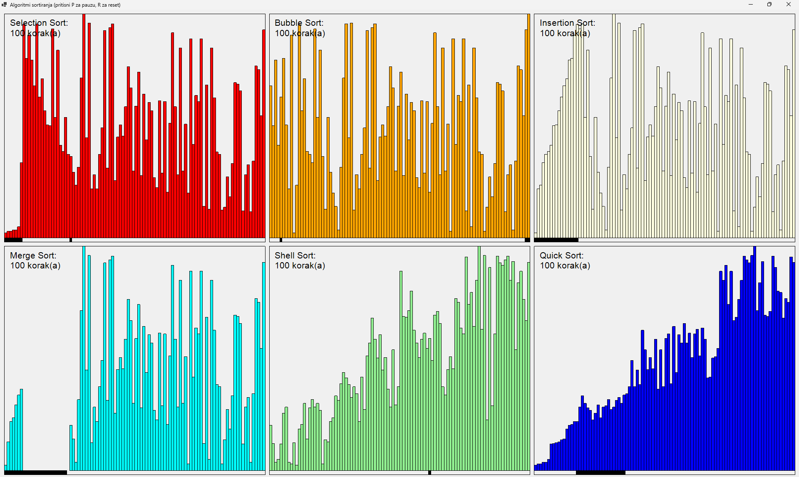
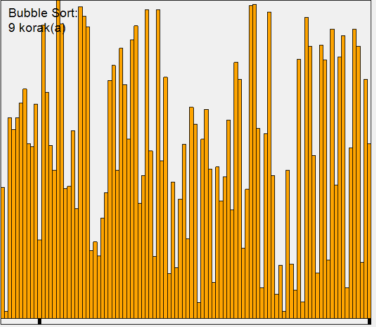

Приказ рада алгоритама сортирања
================================

Тема овог примера је апликација која илуструје рад шест алгоритама сортирања. Прозор апликације 
је подељен на шест делова (у два реда по три), и у сваком од ових делова приказује се рад 
једног од одабраних алгоритама. 

    Изглед апликације која приказује рад неколико алгоритама сортирања 

Одлуке у вези са концептом апликације
-------------------------------------
 
Да би рад појединих алгоритама сортирања могао да се испрати погледом и разуме, важно је да се 
алгоритми не извршавају сувише брзо. Идеално, алгоритми треба да застану после сваке размене 
елемената низа и да сачекају да се прикаже ново стање. Ово застајкивање алгоритама може да се 
постигне помоћу метода ``Thread.Sleep``, али ако се апликација извршава у једној нити, то није 
најбоље решење. Наиме, док апликација чека задати број милисекунди, она не може да реагује на 
акције корисника, па је мање одзивна и оставља утисак да нешто није у реду са програмом. Употреба 
више нити би отклонила овај проблем, али такво решење је непотребно сложено за оно што желимо да 
постигнемо у овом примеру. Једноставнија идеја је да на догађај тајмера извршимо по један корак 
сваког од изабраних алгоритама сортирања и освежимо приказ. Тиме апликација између узастопних 
догађаја тамера остаје спремна да по потреби реагује на остале догађаје.

|

Постоје различити начини да се за све изабране алгоритме сортирања изврши по један корак. Један начин 
је да се алгоритми сортирања напишу на специфичан начин, тако да се при једном позиву одређеног метода 
извршава само један корак алгоритма. Узмимо за пример познати алгоритам `Bubble Sort`, који као целина 
изгледа овако: 

.. code-block:: csharp

    for (iSortedFrom = a.Length - 1; iSortedFrom > 0; iSortedFrom--)
        for (iBubble = 0; iBubble < iSortedFrom; iBubble++)
            if (a[iBubble] > a[iBubble + 1])
                Swap(iBubble, iBubble + 1);

За овај алгоритам сортирања би могао да се напише метод који извршава само један корак тог алгоритма, 
односно једну итерацију унутрашње петље. У том случају, бројачке променљиве петљи би морале да 
постану поља класе, како би метод при следећем позиву могао да настави поступак тамо где је стао. 
У случају овакве организације, метод би могао да изгледа овако:

.. code-block:: csharp

        private int iSortedFrom;
        private int iBubble;
        private bool finished;
        
        public void DoSortingStep()
        {
            if (finished)
                return;

            if (iBubble == iSortedFrom - 1)
            {
                iBubble = 0;
                iSortedFrom--;
                if (iSortedFrom <= 1)
                {
                    finished = true;
                    return;
                }
            }

            if (a[iBubble] > a[iBubble + 1])
            {
                Swap(iBubble, iBubble + 1);
            }
            iBubble++;
        }

Видимо да се чак и код овако једноставног алгоритма поступак прилично закомпликовао. Можемо да 
претпоставимо да би код сложенијих алгоритама, а поготово код оних рекурзивних, издвајање једног 
корака у посебан метод било знатно сложеније. 

На срећу, постоји једноставно решење које нам омогућава да алгоритме записане на уобичајени начин 
ипак извршавамо корак по корак, враћајући контролу апликацији после сваког корака, како би она могла 
да одговори на евентуалне догађаје. Довољно је да метод напишемо тако да не враћа ``void`` него нпр. 
``IEnumerable<int>``. При томе нам уопште нису битне враћене вредности које чине колекцију, већ само 
чињеница да после сваке враћене вредности можемо да паузирамо извршавање метода враћајући контролу, 
а да касније наставимо извршавање метода тачно тамо где је заустављен. Семантика наредбе ``yield`` 
нам омогућава управо такво извршавање метода ``DoSortingStep()``. Како је сама колекција коју враћа 
метод небитна, можемо као елементе колекције да враћамо нпр. нуле, јер се сама колекција и не користи 
на страни која позива метод ``DoSortingStep``. Ево како би метод могао да се напише по овој идеји: 

.. code-block:: csharp

    public IEnumerable<int> DoSortingStep()
    {
        for (iSortedFrom = a.Length - 1; iSortedFrom > 0; iSortedFrom--)
            for (iBubble = 0; iBubble < iSortedFrom; iBubble++)
                if (a[iBubble] > a[iBubble + 1])
                {
                    Swap(iBubble, iBubble + 1);
                    yield return 0;
                }

        finished = true;
    }

Организација класа
------------------

Метод ``DoSortingStep`` ће за сваки алгоритам сортирања да изгледа другачије, па је природно да 
уведемо заједничку базну апстрактну класу ``Algorithm``, у којој ће овај метод да буде апстрактан. 
Програм би могао да се напише и тако да ово буде једини апстрактан метод, јер тренутно стање низа 
код сваког алгоритма може да се прикаже истим методом (различити су само подаци, попут вредности у 
низу, боје стубића, назива алгоритма и слично). Ми смо у приказ додали и исцравање хоризонталних 
црних правоугаоника испод графикона који представља низ. Ови правоугаоници су различити за сваки 
алгоритам и помажу да се боље разуме и прати рад алгоритма. 

    Приказ рада једног од алгоритама сортирања (притиснути F5 за анимацију).

Ови црни правоугаоници сами по себи не захтевају да се приказивање реализује као нови апстрактан метод. 
Могуће је, на пример, да се у базној класи дефинише заштићена листа правоугаоника, или података који 
дефинишу те правоугаонике, а да се у методу ``DoSortingStep`` листа ажурира на начин који одговара 
конкретном алгоритму. За такво решење се нисмо одлучили јер се њиме "прља" алгоритам сортирања, који 
би онда радио и нешто што нема везе са сортирањем (него само са приказом), а то цео програм чини мање 
јасним. 

У нашем решењу, све наредбе за исцртавање су смештене у заштићени метод базне класе, али је остављен 
и апстрактан јавни метод ``Display``. Тиме је омогућено да се из сваке од изведених класа које 
представљају конкретне алгоритме, позове заједнички метод за приказ са другачијом листом правоугаоника. 

Ево како изгледа базна класа ``Algorithm``.

.. activecode:: algorithm
    :passivecode: true
    :includesrc: src/primeri/algoritmi_sortiranja/algorithm.cs

Класе изведене из класе ``Algorithm`` су све веома кратке и међусобно сличне. На пример, класа 
``BubbleSort`` изгледа овако:

.. activecode:: bubble_sort
    :passivecode: true
    :includesrc: src/primeri/algoritmi_sortiranja/bubble_sort.cs

Остале класе које представљају конкретне алгоритме можете да видите кликом на одговарајуће дугме. 

.. reveal:: dugme_selection_sort
    :showtitle: Класа SelectionSort
    :hidetitle: Сакриј класу SelectionSort

    **Класа** ``SelectionSort``
    
    .. activecode:: selection_sort
        :passivecode: true
        :includesrc: src/primeri/algoritmi_sortiranja/selection_sort.cs

.. reveal:: dugme_insertion_sort
    :showtitle: Класа InsertionSort
    :hidetitle: Сакриј класу InsertionSort

    **Класа** ``InsertionSort``
    
    .. activecode:: insertion_sort
        :passivecode: true
        :includesrc: src/primeri/algoritmi_sortiranja/insertion_sort.cs

.. reveal:: dugme_shell_sort
    :showtitle: Класа ShellSort
    :hidetitle: Сакриј класу ShellSort

    **Класа** ``ShellSort``
    
    .. activecode:: shell_sort
        :passivecode: true
        :includesrc: src/primeri/algoritmi_sortiranja/shell_sort.cs

.. reveal:: dugme_merge_sort
    :showtitle: Класа MergeSort
    :hidetitle: Сакриј класу MergeSort

    **Класа** ``MergeSort``
    
    .. activecode:: merge_sort
        :passivecode: true
        :includesrc: src/primeri/algoritmi_sortiranja/merge_sort.cs

.. reveal:: dugme_quick_sort
    :showtitle: Класа QuickSort
    :hidetitle: Сакриј класу QuickSort

    **Класа** ``QuickSort``
    
    .. activecode:: quick_sort
        :passivecode: true
        :includesrc: src/primeri/algoritmi_sortiranja/quick_sort.cs

    
Поред класа које представљају алгоритме сортирања, потребна је још и класа форме. У овом примеру, 
ни она није нарочито сложена -- сви методи за обраду догађаја су веома кратки.

.. activecode:: Form1
    :passivecode: true
    :includesrc: src/primeri/algoritmi_sortiranja/Form1.cs

Ако желите да испробате апликацију, потребно је да урадите следеће:

- Креирајте нови пројекат типа ``Windows Forms App`` и назовите га ``SortingAlgorithms``,
- Додајте у пројекат фајлове са класама које представљају алгоритме сортирања (базна и шест 
  изведених класа) и копирајте у њих кôд који је дат горе, 
- Прегазите кôд фајла ``Form1.cs`` кодом датим непосредно изнад,
- Прегазите кôд фајла ``Form1.Designer.cs`` кодом датим у наставку.

.. reveal:: dugme_Form1_Designer
    :showtitle: Фајл Form1.Designer.cs
    :hidetitle: Сакриј фајл Form1.Designer.cs

    Садржај фајла ``Form1.Designer.cs``
    
    .. activecode:: Form1_Designer
        :passivecode: true
        :includesrc: src/primeri/algoritmi_sortiranja/Form1.Designer.cs
